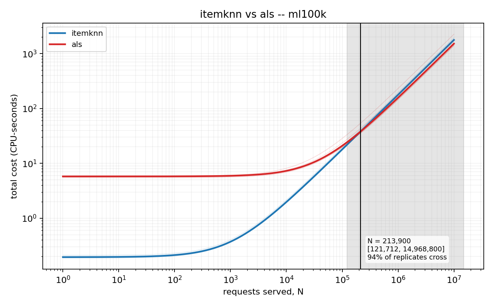
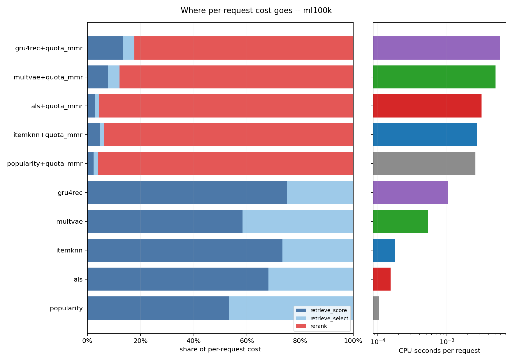
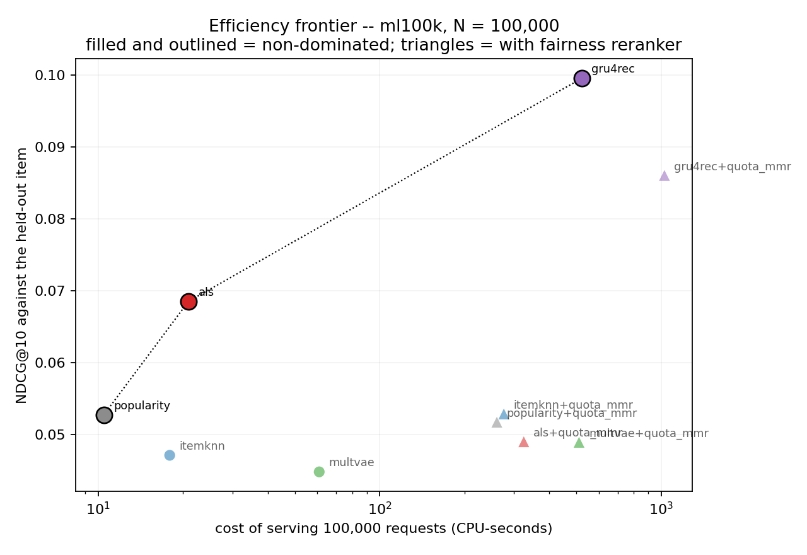
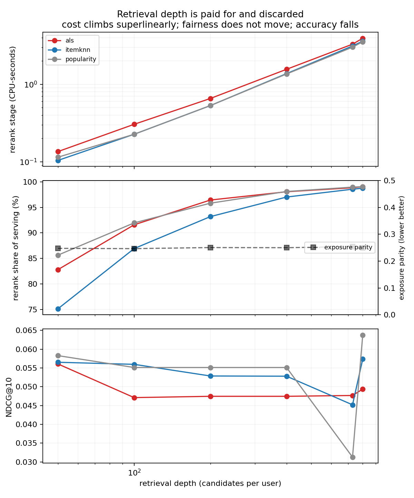

# The cost of a recommendation, by stage

**Status:** complete, after a full regeneration. Every number below is recomputed from the
raw per-run and per-user records of three sweeps — `results/main_v2/` (170 runs),
`results/depth_v2/` (90 runs) and `results/rerankers_v2/` (63 runs) — all taken at
revision `19c535a` against companion revision `5147c0d`, both with clean working code, on
mains power, on an otherwise idle machine.

Three earlier results directories (`results/main/`, `results/depth/`,
`results/rerankers/`) are **superseded and must not be cited**. They are kept as
historical evidence; `results/README.md` records what was wrong with each and why none of
them can have its code state reconstructed. This report cites the `_v2` directories only.

An external audit of the first version of this report found six code defects and a number
of overstated claims. Several findings below are weaker than they were, two are retracted
outright, and one was reversed. Those changes are marked where they occur rather than
quietly absorbed, because the alternative is a report whose confidence is not evidence of
anything.

---

## Summary of findings

**The break-even method works; the comparison the earlier draft led with does not
reproduce.** Of 45 configuration pairs on MovieLens 100K, **12 produce a break-even
request volume stable enough to report**, with 95 % bootstrap intervals spanning only
1.1× to 7.8×. ItemKNN against ALS — the pair the first draft put in its opening sentence
— is **not** one of them: its interval spans **123×** and the sign of its denominator
flips across repeats of identical work. The cause is a specific, transferable property of
the cost unit, and diagnosing it is a more useful contribution than the number it
replaces. §7.1

**A fairness reranker is 81.6–97.6 % of per-request serving cost**, multiplying serving
cost **5.7× to 42.8×**. Adding exposure fairness to a popularity baseline on MovieLens
100K multiplies its serving cost **24.9-fold**. No prior energy study appears to have
costed this stage at all. §7.2

**Paying that multiplier does not reliably buy fairness.** On `luxury_beauty` the most
expensive configuration measured — 42.8× serving cost — changed exposure parity for **0 of
1,000 paired user-records**, in either direction. On `software` a comparable multiplier did
move parity, from 1.500 to 1.000, while cutting NDCG from 0.0048 to 0.0019. Whether the
spend buys anything is catalogue-dependent and has to be checked per deployment. §7.2

**Retrieve shallowly when reranking, but not for the reason first claimed.** Going from 50
to 800 candidates costs **31.5×** more (cost scales O(n^1.21–1.29)) and yields no
measurable fairness improvement — exposure parity moves by 0.0075 to 0.0177 across a 16×
range. The earlier claim that accuracy *falls* with depth is **retracted**: ρ = −0.115,
p = 0.45. The recommendation survives on cost alone. §7.6

**MovieLens 100K is an outlier, and it is the catalogue everyone uses.** There, nothing
tested beats recommending the globally most popular items reproducibly — including
GRU4Rec, which reaches significance in **1 of 5 repeats** despite costing 2.6 million
times popularity's training cost. ItemKNN beats popularity in every repeat on three of the
other four catalogues. A method validated only on ML-100K can be reported as beating a
baseline it does not beat. §7.5

**Retraining cadence is a larger lever than model choice.** Holding traffic fixed at
100,000 requests, GRU4Rec's total cost moves **801×** between training once and retraining
every 100 requests. What that buys was **not measured** and is not claimed. §7.4

**A classical reranker matches the quantum-inspired ones exactly, for ~1/290th the cost.**
`balanced_quota` reaches exposure parity 0.200 — the optimum permitted by the integrality
of list positions — on all three retrieval families, and ties both annealers on **900 of
900** paired user-records while costing **288–290×** and **232–233×** less. This
**retracts** §9 and §10 of the earlier draft, which claimed the annealers reached a
fairness optimum classical methods could not. What the annealers do still buy is list
diversity: intra-list similarity 0.286–0.297 against 0.357, better on 893 of 900 users,
p < 0.001. §10

**The energy backend cannot be used as an energy axis on this hardware.** codecarbon 3.3.0
reports a hardcoded 10.000 W for RAM which supplies 81–87 % of its total, 0 % CPU
utilisation under eight saturated cores, and a total reported power that moves **1.04× to
1.06×** between an idle machine and a saturated one. Its own pass/fail verdict **flips
between two runs of the same controlled test on the same idle machine**, which is the
sharpest evidence that it is not measuring anything. Two claims the earlier draft made here
did not reproduce and are withdrawn. §5

---

## 1. The question

A deployer choosing a recommender model wants to know what it will cost to run. The
green-recommender literature answers a different question: it reports the energy of an
experimental *run*, which adds together

- a cost paid **once**, at deployment — training; and
- a cost paid on **every request** — retrieval, ranking, reranking.

Those are not the same kind of quantity and their sum is not interpretable. A model that
trains for an hour and then serves nearly free, and one that trains instantly and then
burns an hour answering queries, can report identical totals and imply opposite
decisions. The sum is dominated by whichever term the experimenter's setup happened to
emphasise: run the evaluation over 100 users and training dominates; run it over
10 million and serving does. Neither number is a property of the model.

Separating them gives

```
C(N) = C_once + N · C_per_request
```

Two families are then two lines, and lines with different slopes **cross**. The crossing
point — the request volume at which the cheaper choice changes — is the form a deployment
decision actually takes, and it is what this project reports.

It also reports where that form **fails**, which turns out to be the more useful half. A
crossing point is a ratio of two differences, so it is only as identifiable as the smaller
of them. §7.1 shows a case where the difference in per-request cost is smaller than the
run-to-run variation in one of its terms, and the crossing point consequently has no
reproducible value. That is not a defect of the method; it is the method reporting that
the question has no answer at this measurement precision, which is what a point estimate
would have concealed.

## 2. What is not claimed

The obvious claim, "nobody has compared model families on energy", is false and this
project does not make it. Wegmeth, Beel and colleagues (ACM TORS 2025; code at
`ISG-Siegen/recsys-carbon-footprint`) measured 63 algorithms across 14 datasets with a
physical smart-plug meter, and separated fit / predict / evaluate. That work is more
comprehensive on the axis it covers than anything here.

Three things it does not do, which this project does:

1. **Amortisation.** Prior work reports energy per run. The break-even request volume
   does not appear.
2. **The reranker as a line item.** The stage decomposition stops at predict. Fairness
   rerankers are proposed steadily in the fairness-in-ranking literature and, as far as
   this search found, have never been costed.
3. **Validity of the measurement instrument** on hardware without power counters —
   which is most laptops, all of Windows, and every VM.

Also not claimed: that any accuracy consequence of retraining cadence was measured (§7.4),
that the fairness spend is worthwhile (§7.2 finds it is sometimes not), or that a QUBO
reranker outperforms a classical one on the fairness objective (§10 finds it does not).

## 3. Setting: why a 15 W laptop is the right machine

Intel i5-8350U (4 physical cores / 8 threads, 15 W TDP), integrated graphics, **15.9 GB
RAM**, Windows 10, Python 3.10.11. No discrete GPU, no RAPL, no smart plug, no cloud
budget. Recorded on every run in `manifest.json` under `machine`.

This is a constraint, and it is also the regime the literature does not cover. Published
energy studies run on server or workstation hardware with instrumentation attached. A
small vendor deploying a recommender does not have that machine; they have this one.
Results measured here describe the hardware such a deployment actually runs on.

The measurement consequences are handled explicitly rather than absorbed: see §4.

## 4. Measurement method

### 4.1 The unit is CPU-seconds

Not kWh, and the reason is §5.

CPU-seconds are read from `time.process_time()`, which the kernel maintains and which
counts **every thread**. That matters more than it sounds: a BLAS matmul spread over four
cores registers four CPU-seconds per wall-second, and a torch training step likewise.
Wall-clock would report such a stage as four times cheaper than it is, which is exactly
backwards for an energy proxy. Measured here, GRU4Rec's training consumed **414.6 to 478.0
CPU-seconds against 103.8 to 120.6 seconds of wall-clock** — a median parallelism of
**3.99×** that wall-clock would have hidden entirely.

**The same property is what breaks §7.1, and anyone reusing this harness should know it
before they start.** Counting every thread makes the unit a good proxy for work done, and
a bad proxy for anything whose thread count is chosen at runtime. On this machine ALS's
scoring stage ran at utilisations of 2.47, 2.02, 1.44, 1.61 and 1.38 across five repeats
of *identical* work, because BLAS re-decides its thread count per process; ItemKNN's ran
at 1.00, 0.98, 0.99, 0.98, 1.01. Two families whose per-request costs differ by less than
that variation cannot be told apart in this unit, however many repeats are taken.

**The mitigation is to pin the thread count before measuring:**

```bash
OMP_NUM_THREADS=1 MKL_NUM_THREADS=1 OPENBLAS_NUM_THREADS=1 \
  python -m experiments.sweep --config experiments/configs/main_v2.yaml
```

This trades throughput for identifiability and would very likely have made the ItemKNN /
ALS crossing reportable. It is stated here, in the method, rather than as a footnote,
because it is the single change most likely to matter to someone repeating this work. The
sweeps below were **not** run that way, and §7.1 reports the consequence rather than
hiding it.

Joules are reported only through `Reading.joules(watts_per_cpu_second)`, which has **no
default argument**. A joule figure cannot appear anywhere in this project's output
without its conversion assumption visible beside it.

`C(N)` is linear, so a crossover computed in CPU-seconds is the *same request count* as one
computed in joules, provided the conversion is a constant. That is a property of the
arithmetic and holds regardless of §5.

### 4.2 Stages

| stage | amortisation | contents |
|-------|--------------|----------|
| `train` | once | fitting the model |
| `rerank_setup` | once | item–item similarity the reranker requires |
| `retrieve_score` | per request | scoring the catalogue for a user |
| `retrieve_select` | per request | taking the top-n from those scores |
| `rerank` | per request | selecting k from the candidate set |

Retrieval is split into scoring and selection because selection turned out to be a large
share of retrieval cost — nearly all of it for popularity, roughly half for ItemKNN.
Reported as one figure it would compress the families toward each other and attribute most
of their serving cost to code that is identical across all of them. Splitting it isolates
the part that is genuinely the family's own.

There is deliberately **no scoring stage**. Metric computation is O(k²) per user in pure
Python; inside a measured window it would be noise against a training run and the
majority of the reading against a cheap retrieval — error concentrated exactly where the
comparison between families is decided. `Stage` has no member for it, so no call site can
pass one.

### 4.3 The four traps

Each was found the hard way. They share a signature: **the run completes, the table looks
normal, and only the cost column is wrong.**

**The probe is not free.** `EmissionsTracker.start()` interrogates the hardware for
seconds. Timing from before it charged that constant to whatever followed; in the
companion project a baseline doing 0.008 s of real work read 5.4 s. The clock now starts
strictly after the probe and stops strictly before teardown.

**The clock is 15.625 ms, not 100 ns.** `time.get_clock_info("process_time")` advertises
100 ns resolution. The true quantum is the scheduler tick — five orders of magnitude
coarser. A 3 ms stage reads either `0.0` or `0.0156`, and two stages differing tenfold
can report the same number. `measure_repeated` repeats work until the window spans ~20
quanta, bounding quantisation error at ~5 %, and divides. Readings that could not be
grown are flagged `below_quantum` rather than reported as measurements. In practice this
meant repeat counts from **1 to 3,868** across stages, all normalised to a window whose
median is **0.3125 s — exactly twenty quanta**. Across all 170 runs of the main sweep,
**no stage fell below the quantum.**

**Battery changes everything except the results.** Unplugged, this machine drops from
1696 MHz to a pinned 1297 MHz; every timing rises and every quality metric stays
byte-identical. Preflight refuses to start on battery. Because a cable can come out at
run seven of twenty, `ConditionsMonitor` also samples power source and CPU frequency
*during* a sweep. §8 records what that channel can and cannot see, which is narrower than
the earlier draft claimed.

**Contention is charged to whoever is running.** Runs are strictly sequential, enforced
by an atomic lockfile. Before starting, machine load is sampled; above a threshold the
sweep aborts, and above a lower threshold every row is stamped `trustworthy=False` and
**the analysis refuses to read it**. This is not hypothetical — during this project's
development the machine was frequently occupied by the companion project's own
experiments, and the guard is what kept those hours from producing a plausible-looking
results table. It is also not sufficient: it samples only at the start, and §8 records a
case where load arriving mid-sweep was caught by a different channel.

### 4.4 A leakage trap, found by running the sweep

The first attempt at the full sweep failed on its second cell, and the cause was not a
cost bug.

Seen items are excluded from recommendation by scoring them `-inf`. Retrieval then asks
for the top *n* candidates. On a small catalogue those two facts collide: `gift_cards`
has 147 items, retrieval depth was set to 200, and a user with twelve interactions has
only 135 candidates that mean anything. The remaining slots were filled with `-inf`
entries — which are, precisely, that user's own history.

Downstream, normalising the candidate scores computed `-inf − -inf = NaN`, so the
reranker received a relevance vector of NaNs, ranked on them, and could place an
already-seen item into the final list. Every metric would still have been computed, and
nothing in the output would have looked wrong.

The fix caps retrieval depth at `n_items − (busiest served user's history)`, records both
the requested and the actual depth on every row — a reranker's cost scales with its
problem size, so a run that quietly retrieved 135 instead of 200 is not comparable to one
that got 200 — and makes the normalisation *raise* on non-finite input rather than
propagate NaN, as an assertion that the cap holds rather than a patch over its absence.

Recording the actual depth is not cosmetic. In the depth sweep, **6 of the 18 runs that
requested 800 candidates received 729**, because that is where the cap bound on
MovieLens 100K. The earlier `results/depth/` directory labelled those rows 800, so its
depth axis had two different problem sizes sharing one label; §7.6 reports actual depth.

Worth stating plainly because it is the project's own thesis turned on itself: the bug
was found by running the experiment, not by reading the code, and it belongs to the same
family as everything in §4.3 — a defect that changes the results and leaves the output
looking entirely normal.

### 4.5 Uncertainty on the break-even, and when to refuse to report one

A crossover is a ratio of two differences:

```
N = (C_once,B − C_once,A) / (C_per_request,A − C_per_request,B)
```

so it amplifies the noise in both, and it is the **denominator** that decides whether the
answer exists. Repeated measurements of identical work on this machine differ — across the
main sweep, by 0.0 % to 57.4 % of the median, with a median spread of 6.6 %. When two
families' per-request costs are closer together than that, the denominator can approach
zero, change sign, and the crossover can move by orders of magnitude or cease to exist.

Every configuration is therefore measured with repeats, and the crossover is reported as
a **percentile bootstrap interval** over them, resampling each family's `(once,
per_request)` pairs jointly — jointly because a moment of background load inflates both,
and resampling them independently would manufacture combinations never observed and
report an interval narrower than the truth. Both schemes are implemented and §7.1 reports
both, because their agreement is itself evidence.

Replicates in which the lines do not cross are **counted, not discarded**. A crossover
found in only a minority of replicates is a null result, not a wide interval.

A crossing is reported only if it passes three tests:

| test | threshold | what it rules out |
|------|-----------|-------------------|
| replicates crossing | ≥ 90 % | a crossing that exists only in some resamples |
| width of the interval | upper / lower < 10× | an interval too wide to act on |
| repeats measured | ≥ 3 | a bootstrap over too few observations to resample |

**The 10× threshold is not tuned, and the data shows why.** Ranked by interval width, the
thirteen pairs on MovieLens 100K that cross in ≥ 90 % of replicates have ratios of

```
1.1  1.2  1.2  1.3  1.3  1.4  1.4  1.6  1.7  1.8  1.9      7.8      123.0
```

Eleven sit at or below 1.9×, one at 7.8×, and one at **123×**. There is nothing between 7.8
and 123 to place a threshold on top of; any cut anywhere in that gap partitions the data
identically, and the 10× used here is simply a round number inside it. A reader is entitled
to suspect a threshold chosen to produce a desired count, so the distribution is given
rather than asserted.

The three conjuncts are independently decisive: removing any one of them changes which
pairs pass. The rule and this distribution are checked by `experiments/verify_claims.py`,
which reads only raw records and never the derived tables.

## 5. Result: the energy backend cannot be used as an energy axis here

**This is a measured result, not a caveat.**

`codecarbon` on hardware without RAPL estimates CPU power from rated TDP and a
utilisation sample. If that estimate does not track utilisation, reported energy
degenerates toward `kWh ≈ constant × seconds`, and every "energy" conclusion drawn from it
is a wall-clock conclusion in different units.

Tested directly with a graded load — 0, 1, 2, 4 and 8 busy **processes** (processes, not
threads: the GIL would let a thread-based load saturate one core while the rest idled,
handing the backend an easier test than it needs to pass). Five conditions of 20 seconds
each.

Reproduced verbatim from `results/validity_v2/graded_load.csv`, measured on **codecarbon
3.3.0** on a machine first confirmed idle — median load 2.8 % over five samples, checked
because an earlier draft of this section reported a figure taken while another process was
running:

| busy workers | reported CPU power | reported utilisation | reported RAM power | total energy | wall |
|--------------|--------------------|----------------------|--------------------|--------------|------|
| 0 | 1.522 W | 0 % | 10.000 W | 6.446e-05 kWh | 20.0 s |
| 1 | 1.515 W | 0 % | 10.000 W | 6.613e-05 kWh | 20.7 s |
| 2 | 1.515 W | 0 % | 10.000 W | 6.619e-05 kWh | 20.7 s |
| 4 | 1.530 W | 0 % | 10.000 W | 6.726e-05 kWh | 20.9 s |
| 8 | 1.659 W | 0 % | 10.000 W | 7.294e-05 kWh | 21.3 s |

Four things, none of which is a matter of precision:

1. **RAM power is exactly 10.000 W at every level, and it dominates the total** —
   contributing 86.6 % of reported energy at idle and 81.3 % at full saturation. A channel
   that is bit-for-bit identical from idle to eight saturated cores is not a noisy
   measurement of the load; it is not a measurement of the load, and it needs no threshold
   to interpret.
2. **The utilisation channel reads 0 % under eight saturated cores** — the one condition
   whose true answer is known in advance.
3. **The CPU channel does respond, and weakly.** Mean CPU power over each window
   (`cpu_kwh ÷ wall_seconds`) moves from 1.551 W to 2.302 W, a **1.48× swing** across the
   full span from idle to saturation, against a true dynamic range of roughly 10× for a
   15 W part.
4. **Because the constant channel dominates, the axis barely moves at all.** Mean total
   reported power goes from 11.603 W to 12.302 W — **1.06×** — while the machine goes from
   idle to fully saturated. §7 spans workloads differing by more than six orders of
   magnitude in cost. An axis with a 6 % dynamic range cannot rank them.

**Two claims from the earlier draft do not survive re-running, and are withdrawn.** The
earlier draft reported that the fully loaded run consumed *less* total energy than the idle
one. **That does not reproduce**: 7.294e-05 against 6.446e-05, the right way round. It was a
property of that run, not of the backend, and stating it as the latter was the same error
this section is about. The earlier draft also read an `R²` of 0.551 against CPU-seconds off a
meter-enabled sweep; that subsection is deleted for the reason in §5.1.

#### The backend's own verdict is not reproducible, which is the sharpest result here

The graded load has now been run three times, and this is worth reporting rather than
resolving by picking one. The two runs on a confirmed-idle machine give:

| | utilisation series | mean CPU power | mean total power | driver's verdict |
|---|---|---|---|---|
| first idle run | 0, 0, **5**, 0, 0 % | 1.606 → 2.182 W (1.36×) | 11.767 → 12.182 W (1.04×) | *"the backend responded"* |
| this run | 0, 0, 0, 0, 0 % | 1.551 → 2.302 W (1.48×) | 11.603 → 12.302 W (1.06×) | *"did not respond to the load"* |

**The verdict flips between two runs of the same experiment on the same idle machine.** The
driver keys on whether any channel changed by more than 2× and the CPU channel's per-second
rate lands either side of that line — 1.53× here, 1.45× before. A backend whose pass/fail
answer is not reproducible across repetitions of a controlled test is not delivering a
measurement, and quoting any single graded-load run as *the* result would be the identical
error §7.1 is about: reporting one draw from a wide distribution as though it were the
distribution.

What is stable across all three runs is the part that matters, and it is the part that needs
no threshold: RAM is a hardcoded 10.000 W supplying **81–87 %** of the total, utilisation
reads **0 % under eight saturated cores** every time, and mean total reported power moves
**1.04× to 1.06×** from idle to saturation. The first run's stray 5 % at two workers, absent
from this one, is further evidence that the utilisation channel is noise rather than a
pinned constant — an erratic channel and a dead one are equally unusable, and the project
should not have to decide which it is to conclude that CPU-seconds is the defensible unit.

The earlier draft of this section quoted the *"responded"* verdict and then argued against
it, on the grounds that the verdict weighs channels equally instead of by their contribution
to the total. That criticism still stands — a channel supplying 13–19 % of the figure should
not be able to vouch for an axis whose remaining 81–87 % is a compile-time constant — and it
is now joined by the stronger objection that the verdict is not even stable. Both idle runs
are kept on disk rather than one being cited from the commit history —
`results/validity_v2/` is this run and `results/validity_v2_repeat1/` the earlier one, each
with its own `verdict.json` — so the comparison above is regenerable and a reader can take
the other view. The third run is not kept: it was taken while this project's own mutation
suite was running in the background, which is the contention error §4.3 describes and §5's
earlier draft committed, so it is a record of a contaminated machine rather than of the
backend.

### 5.1 Why no other route was available

The machine exposes no RAPL. WSL2 does not help — verified rather than assumed:
`/sys/class/powercap` exists but is empty and `/dev/cpu/0/msr` is absent, because the
hypervisor does not pass the counters through. Colab is not a substitute either, since a
shared CPU reintroduces contention.

**Consequence.** CPU-seconds is the reported unit. The `codecarbon` behaviour is folded in
as a result of the project rather than worked around silently, and
`experiments/validity.py` reproduces it on any machine in about two minutes.

An earlier draft carried a second subsection here, reporting a regression of reported
energy on elapsed time over 144 readings from a meter-enabled sweep, and concluding that
the energy column was not even a rescaled clock. **It has been deleted.** The sweep it
rested on (`results/energy/`) was taken at revision `511d993` with a dirty working tree
and against a superseded companion revision, so its code state cannot be reconstructed and
its numbers cannot be regenerated. The claim may well have been right; it was not
supported by a reproducible artefact, and a negative result about a widely used tool needs
one more than most. Re-establishing it would require a fresh meter-enabled sweep, which is
listed in §11.

## 6. Datasets

Five catalogues measured, spanning roughly two orders of magnitude in size, because the
break-even claim is a statement about how serving cost scales with catalogue size and
cannot be demonstrated on one. Users, items and density are read from the run records;
interactions are their product.

| catalogue | users | items | interactions | density | groups |
|-----------|-------|-------|--------------|---------|--------|
| `gift_cards` | 456 | 147 | 2,498 | 0.0373 | popularity tiers |
| `software` | 1,779 | 727 | 10,073 | 0.0078 | popularity tiers |
| `luxury_beauty` | 3,589 | 1,365 | 23,860 | 0.0049 | popularity tiers |
| `ml100k` | 943 | 1,349 | 98,344 | 0.0773 | curator genres |
| `digital_music` | 16,252 | 11,268 | 127,939 | 0.0007 | popularity tiers |
| `appliances` | 13 | 4 | 23 | — | **excluded** |

Each sweep serves **200 evaluation users** per catalogue (100 in the reranker sweep of
§10). All figures are after 5-core filtering and a leave-one-out split, using the companion
project's preprocessing so that the two projects agree exactly on which interactions
survive.

`appliances` is excluded and the exclusion is stated rather than left as a gap: the
ratings-only export is so long-tailed that 5-core filtering reduces it to 13 users and 4
items. That is a property of the export, not a loading bug, and a full row of metrics
computed over four items would be a number rather than a measurement. The driver refuses
it by a viability check on every catalogue, and records the refusal in
`manifest.json` under `skipped_catalogues`.

MovieLens uses **curator genres** for fairness groups rather than popularity tiers. A
popularity partition is derived from the same interaction counts being evaluated, so any
fairness result on it can be argued to be structural; genres are assigned independently
of the data.

One correction to the companion's shared loader was applied between the superseded sweeps
and these: a duplicate-interaction defect. It affected `digital_music` only. MovieLens
100K is byte-identical before and after — 943 users, 1,349 items, density 0.0773 — which
is why the depth and reranker sweeps, both ML-100K-only, were unaffected by it.
`results/README.md` records this per directory.

## 7. Results

**Provenance.** `results/main_v2/`: **170 runs** — 5 catalogues × up to 5 families ×
{no reranker, `quota_mmr`} × 5 repeats — serving 200 users each at retrieval depth 200 and
k = 10. **Zero failures. All 170 rows passed the trust check** (machine 0.4 % busy at
start, against a 15 % threshold). The conditions monitor recorded **mains power throughout,
across 1,755 samples**, and no stage fell below the clock quantum. Code revision `19c535a`
with `dirty=False`; companion `5147c0d` with `dirty=False`.

Run-to-run spread on identical work ranged from **0.0 % to 57.4 %** of the median, with a
median of **6.6 %** — measured as `(max − min) / median` within each
`(catalogue, family, reranker)` cell, over both `cpu_once` and `cpu_per_request`, giving 68
such figures. The definition is stated because the two columns disagree: per-request costs
alone span 2.5 % to 57.4 % with a median of 8.4 %, and one-off costs 0.0 % to 50.0 % with a
median of 5.3 %. That is the noise floor every difference below has to clear, and it is
why the break-even is reported as an interval rather than a point. It is also considerably
tighter than the superseded sweep's, which is what makes the §7.1 diagnosis possible: the
remaining instability is not general noise, it is localised to one stage of one family.

### 7.1 Break-even between families: the method, and where it fails

**Twelve of 45 configuration pairs on MovieLens 100K produce a break-even volume this
analysis is willing to report.** Their intervals are narrow — the ratio of upper to lower
bound runs from 1.1× to 7.8× — and every one of them crosses in 100 % of bootstrap
replicates. All twelve are listed, in order of interval width, so that no question of
selection arises:

| cheaper below N | cheaper above N | N | 95 % CI | width | replicates crossing |
|---|---|---|---|---|---|
| `als` | `popularity`+`quota_mmr` | 2,337 | 2,173 – 2,441 | 1.1× | 100 % |
| `als` | `itemknn`+`quota_mmr` | 2,110 | 1,921 – 2,242 | 1.2× | 100 % |
| `gru4rec` | `multvae`+`quota_mmr` | 102,298 | 99,951 – 122,474 | 1.2× | 100 % |
| `itemknn` | `popularity`+`quota_mmr` | 45 | 41 – 52 | 1.3× | 100 % |
| `als`+`quota_mmr` | `gru4rec` | 190,710 | 178,596 – 236,787 | 1.3× | 100 % |
| `gru4rec` | `popularity`+`quota_mmr` | 266,815 | 240,566 – 339,060 | 1.4× | 100 % |
| `gru4rec` | `itemknn`+`quota_mmr` | 247,667 | 212,279 – 306,067 | 1.4× | 100 % |
| `multvae` | `popularity`+`quota_mmr` | 1,773 | 1,638 – 2,630 | 1.6× | 100 % |
| `itemknn`+`quota_mmr` | `multvae` | 1,585 | 1,400 – 2,357 | 1.7× | 100 % |
| `als`+`quota_mmr` | `multvae`+`quota_mmr` | 968 | 606 – 1,088 | 1.8× | 100 % |
| `als` | `multvae`+`quota_mmr` | 340 | 210 – 391 | 1.9× | 100 % |
| `als` | `multvae` | 4,969 | 816 – 6,345 | 7.8× | 100 % |

The first column is the configuration that is cheaper *below* N and the second the one that
is cheaper above it, so the pair `itemknn` / `popularity`+`quota_mmr` reads: below 45
requests ItemKNN is cheaper, above it the fairness-reranked popularity baseline. Ten of the
twelve pit an unreranked family against a reranked one, which is the comparison a deployer
adding fairness actually faces; the remaining two are `als`+`quota_mmr` against
`multvae`+`quota_mmr` and `als` against `multvae`.

Read the first row as: below about 2,300 requests, ALS is the cheaper deployment than a
fairness-reranked popularity baseline; above it, the reranked baseline wins. Neither
family's training cost nor its serving cost answers that on its own. This is the kind of
number no per-run energy table can produce, and it is the project's method working.

The denominator matters as much as the twelve. **Most pairs do not cross at all** — one
family is cheaper at every volume, which is a finding and not a missing number — and
reporting only the twelve without saying how many were tested would misrepresent how often
the amortisation question even has an answer.

#### The pair the earlier draft led with is not reportable

The first version of this report opened with **ItemKNN against ALS on MovieLens 100K at
N = 112,730 requests, 95 % CI [51,128 – 180,720]**. Regenerated on the corrected code with
five repeats, the same comparison gives:

| scheme | N | 95 % CI | width | replicates crossing |
|--------|---|---------|-------|---------------------|
| independent resampling | 213,900 | 121,712 – 14,968,800 | **123×** | 94.3 % |
| repeat-paired resampling | 174,960 | 143,446 – 14,968,800 | **104×** | 94.2 % |

Both schemes agree, which rules out the resampling design as the cause. The interval spans
two orders of magnitude and the point estimate has moved by 1.9×. **This comparison has no
reportable break-even volume.** The earlier figure was a single sweep that happened to land
in a narrow part of a very wide distribution.

A smaller symptom points the same way. The bootstrap is seeded and returns the same answer
on every call, but for this pair it is not symmetric under argument order: computing it as
ItemKNN-against-ALS gives 213,900 and 94.3 %, and as ALS-against-ItemKNN gives 214,500 and
94.2 %. The two differ by 0.3 % — negligible against a 123× interval, and the point is not
the size but that a well-behaved estimate would not move at all. The table above uses the
order the heading states. The repeat-paired scheme is symmetric, as it should be, and the
twelve reportable pairs in the previous table are unaffected.

The cause is identifiable, and it is not general noise:

- The **numerator** — the difference in one-off training cost, ALS's 5.78 CPU-seconds
  against ItemKNN's 0.195 — is stable, varying by **7.7 %** across repeats.
- The **denominator** — the difference in per-request cost, 1.776e-4 for ItemKNN against
  1.515e-4 for ALS — is about 2.6e-5, and it is **not stable**. Across the five repeats it
  reads −3.16e-05, +3.80e-07, +3.68e-05, +3.26e-05, +3.88e-05. **The sign flips in one
  repeat of five**, and in another it is within a factor of 70 of zero. A crossing whose
  denominator changes sign is a crossing that does not exist in that replicate.
- The reason the denominator moves is §4.1. ALS's `retrieve_score` stage ran at CPU
  utilisations of **2.47, 2.02, 1.44, 1.61, 1.38** across the five repeats — BLAS
  re-deciding its thread count per process — while ItemKNN's, single-threaded, held at
  **1.00, 0.98, 0.99, 0.98, 1.01**. CPU-seconds counts every thread, so ALS's per-request
  cost inherits that decision. The variation it induces in ALS alone is larger than the
  difference between the two families.

**This is the most transferable finding in the report.** It is not a property of these two
models; it is a property of measuring cost in a thread-counting unit while letting a
threading library choose its own width. Any study using CPU-time, core-seconds, or a
power proxy derived from utilisation will hit it, and will hit it invisibly, because the
resulting numbers look entirely ordinary — a plausible break-even volume, a plausible
interval, and no indication that a rerun would give a different answer. The fix is one
environment variable (§4.1), and the cost of not knowing about it was this project's
headline result.



The shaded band is the bootstrap interval and the faint lines are the individual repeats.
The plot is kept, unflattering, because the width the band claims is visibly earned and
the divergence of the repeats is the finding.

### 7.2 The cost of fairness reranking

**The reranker accounts for 81.6 – 97.6 % of per-request cost, multiplying serving cost by
5.7× to 42.8×.** Measured across all five catalogues and every family, 17 configurations.
The share is computed per run and then taken as a median, not as a ratio of two medians,
and it is the reranking stage's share of the three serving stages — a ratio of quantities
measured over the same users, so no user count enters it.

| catalogue | family | rerank share | serving multiplier |
|-----------|--------|--------------|--------------------|
| `luxury_beauty` | `popularity` | 97.6 % | 42.8× |
| `software` | `als` | 97.3 % | 37.6× |
| `software` | `itemknn` | 97.0 % | 33.2× |
| `gift_cards` | `als` | 96.8 % | 29.8× |
| `software` | `popularity` | 96.4 % | 27.3× |
| `gift_cards` | `itemknn` | 96.3 % | 26.7× |
| `luxury_beauty` | `itemknn` | 96.2 % | 26.2× |
| `gift_cards` | `popularity` | 96.1 % | 25.8× |
| `ml100k` | `popularity` | 95.9 % | 24.9× |
| `luxury_beauty` | `als` | 95.8 % | 24.3× |
| `ml100k` | `als` | 95.7 % | 21.1× |
| `digital_music` | `popularity` | 94.3 % | 18.1× |
| `ml100k` | `itemknn` | 93.5 % | 15.5× |
| `digital_music` | `itemknn` | 88.9 % | 9.4× |
| `ml100k` | `multvae` | 87.9 % | 8.8× |
| `digital_music` | `als` | 81.9 % | 6.3× |
| `ml100k` | `gru4rec` | 81.6 % | 5.7× |

One caveat the row-level records make visible. `gift_cards` has 147 items, so the cap of
§4.4 bound there and its runs used a reduced retrieval depth rather than the nominal 200.
Since §7.6 shows the share depends on depth, those rows are not at the same problem size as
the rest. They are kept because the qualitative claim is unaffected and the actual depth is
recorded on every affected row rather than being absorbed into an average.



The left panel is share on a linear axis and the right is absolute cost on a log one,
because a stacked bar on a log axis has segment widths that mean nothing — and share is
exactly what this claim is about.

The share has structure rather than being a constant: it falls as retrieval itself gets
more expensive. The reranker's cost is set by its problem size — 200 candidates, k = 10 —
not by the model beneath it, so it dominates a cheap popularity lookup almost entirely
and merely multiplies the cost of serving a GRU4Rec by 5.7.

This is, as far as the literature search found, the first published figure for what a
fairness reranker costs as a share of a recommender pipeline. It is also the project's
most directly actionable number: a deployer adding exposure fairness to a popularity
baseline on MovieLens 100K is not paying a margin, they are paying **24.9 times** their
serving cost.

#### What that spend buys, and where it buys nothing

The earlier draft asserted the benefit was "large and unambiguous". Checked per user
against the unreranked configuration on the same catalogue, family and repeat, it is
neither.

**On `luxury_beauty` with a popularity retriever — the most expensive configuration in the
table, at 42.8× serving cost — exposure parity changed for 0 of 1,000 paired user-records,
in either direction.** Parity sits at 1.5000 before and 1.5000 after. Gini moves from
0.9916 to 0.9917 and catalogue coverage from 0.0125 to 0.0125. NDCG changes for 5 of the
1,000. The reranker ran, cost 0.83 CPU-seconds per 200 users, and produced the same
allocation it was given.

The reason is a property of the catalogue rather than of the reranker: with 1,365 items and
a density of 0.0049, a popularity retriever's top-200 candidate set for every user is drawn
from essentially the same head, and the exposure groups present in that candidate set do
not offer the reranker a feasible reallocation. A fairness objective normalised over the
groups actually available cannot improve on a candidate set that contains one.

**On `software`, the same reranker did move parity — from 1.5000 to 1.0000 on all 1,000
paired records — and cut NDCG from 0.0048 to 0.0019**, a 60 % relative loss, while
catalogue coverage rose from 0.0193 to 0.0303. That is a real trade, and a steep one.

So the honest statement is not "reranking buys fairness at 5–43× cost". It is: **the
multiplier is reliable, the benefit is not.** On one catalogue the most expensive
configuration measured bought literally nothing; on another a comparable one bought a
parity improvement by giving up most of its accuracy. Which of those a deployment gets is
not predictable from the cost table, and has to be measured per catalogue. An earlier
draft of this section reported the benefit as uniform because it compared medians across
configurations instead of pairing users within them.

### 7.3 Efficiency frontier

Non-dominated configurations at N = 100,000 requests, on cost and median NDCG:

| catalogue | frontier |
|-----------|----------|
| `ml100k` | `popularity`, `als`, `gru4rec` |
| `software` | `popularity`, `itemknn` |
| `digital_music` | `popularity`, `itemknn`, `itemknn+quota_mmr` |
| `luxury_beauty` | `popularity`, `itemknn`, `itemknn+quota_mmr` |
| `gift_cards` | `popularity`, `itemknn` |

`popularity` appears on **all five** frontiers, always as the cheap endpoint.

**ItemKNN and MultVAE are dominated on MovieLens 100K.** §7.5 finds that neither family's
accuracy difference from popularity is detectable per user on that catalogue. That does not
weaken the conclusion — it strengthens it. Domination normally rests on being worse on one
axis and no better on the other, which invites the objection that the accuracy gap is
noise. Here the accuracy gap being indistinguishable is the point: at **no detectable
difference in accuracy**, both cost more.



The frontier's axes are accuracy and cost only, so most reranked configurations fall behind
it — reranking buys exposure parity, which is not an axis here. `digital_music` and
`luxury_beauty` are the exceptions worth noting: there `itemknn+quota_mmr` is non-dominated
on accuracy and cost alone, meaning reranking did not cost accuracy on those catalogues.

### 7.4 Retraining cadence

Holding traffic fixed at 100,000 requests on MovieLens 100K and varying only how often the
model is retrained. "Never" is one training at deployment; a cadence of *C* adds
`100,000 / C` further trainings. All figures CPU-seconds.

| retrain every | `popularity` | `itemknn` | `als` | `multvae` | `gru4rec` |
|---------------|--------------|-----------|-------|-----------|-----------|
| never | 10.5 | 18.0 | 20.9 | 61.0 | 522 |
| 100,000 | 10.5 | 18.1 | 26.7 | 64.7 | 940 |
| 10,000 | 10.5 | 19.9 | 78.7 | 97.9 | 4,701 |
| 1,000 | 10.5 | 37.5 | 599 | 430 | 42,308 |
| 100 | 10.6 | 213 | 5,802 | 3,748 | 418,381 |

**Cadence moves total cost by 801× for the neural family, 277× for ALS, 61× for MultVAE and
12× for ItemKNN.** That is a far larger lever than the choice of model, and it is absent
from every energy figure that reports a single run.

The ordering also reverses: **ALS and MultVAE swap between a 10,000-request and a
1,000-request cadence** — 79 against 98 CPU-seconds at the former, 599 against 430 at the
latter. ALS serves nearly four times cheaper (1.515e-4 against 5.729e-4) but trains 1.6×
dearer, so which is preferable depends entirely on how fast the catalogue goes stale — a
question the model comparison itself cannot answer.

`popularity` is cheapest at every cadence here, which is a degenerate but honest outcome:
its training costs 1.58e-4 CPU-seconds, so retraining costs it nothing. The cadence axis
only discriminates between models that actually train.

**What retraining buys was not measured.** An earlier draft stated that cadence moves cost
"while changing its accuracy not at all". That claim has been **deleted rather than
softened**: no model in any sweep was retrained on newer data, because the harness has no
temporal split to retrain across. The cost axis of this table is measured; the accuracy
axis does not exist. A deployer reading this table should understand it as the price list
for a decision whose benefit this study cannot price.

### 7.5 Accuracy, tested rather than averaged

Paired Wilcoxon tests against a popularity baseline on the same catalogue and repeat, with
one Holm correction per repeat. Reporting **how many of the five repeats reach
significance** rather than pooling users across repeats, because pooling treats the same
200 users measured five times as 1,000 independent observations.

| catalogue | family | repeats significant on NDCG |
|-----------|--------|------------------------------|
| `luxury_beauty` | `itemknn` | **5 of 5** |
| `luxury_beauty` | `als` | **5 of 5** |
| `software` | `itemknn` | **5 of 5** |
| `software` | `als` | **5 of 5** |
| `gift_cards` | `itemknn` | **5 of 5** |
| `digital_music` | `itemknn` | 4 of 5 |
| `digital_music` | `als` | 1 of 5 |
| `ml100k` | `gru4rec` | 1 of 5 |
| `gift_cards` | `als` | 0 of 5 |
| `ml100k` | `itemknn` | 0 of 5 |
| `ml100k` | `als` | 0 of 5 |
| `ml100k` | `multvae` | 0 of 5 |

**ItemKNN beats the popularity baseline in every repeat on three of five catalogues**, and
in four of five repeats on a fourth. So the strong version of the Green RecSys concern —
that expensive models routinely buy nothing — is *not* what this study found, and an
earlier draft said it did on the strength of MovieLens 100K alone.

What the data does support is narrower and still worth saying:

- **MovieLens 100K is the exception, and it is the catalogue everyone uses.** There,
  *nothing* tested beats recommending the globally most popular items reproducibly.
  ItemKNN, ALS and MultVAE reach significance in 0 of 5 repeats. **GRU4Rec reaches it in
  1 of 5** (Holm-corrected p of 0.041, 0.459, 0.720, 1.000, 1.000) — for 417.9
  CPU-seconds of training against popularity's 1.58e-4, a factor of **2.6 million**. The
  earlier draft reported GRU4Rec as beating the baseline on that catalogue, from a single
  repeat. It does not, reproducibly. This makes the outlier claim stronger, not weaker.
- **The winner is catalogue-dependent.** ALS beats popularity in every repeat on two
  catalogues and in none on two others. ItemKNN, which is *dominated* on ML-100K, is the
  most reliable performer across the rest.
- **Means would have hidden it, and one repeat would have too.** Reporting the modal
  outcome across repeats is what distinguishes `digital_music`/`als` at 1 of 5 from
  `software`/`als` at 5 of 5; a single sweep could have returned either.

### 7.6 How much of §7.2 is an artefact of retrieval depth?

The reranking-cost claim is measured at one retrieval depth, and the reranker's cost
scales with its problem size — so as stated it is a claim about 200 candidates. Testing it
meant varying depth over a 16× range with everything else fixed: 90 runs on MovieLens
100K, three families, three repeats, with and without the reranker. Depths are the
**actual** depths achieved, not the requested ones (§4.4).

**Reranker share of per-request cost, with `quota_mmr`:**

| actual depth | `popularity` | `itemknn` | `als` |
|-------|--------------|-----------|-------|
| 50 | 85.7 % | 75.1 % | 82.8 % |
| 100 | 92.0 % | 86.9 % | 91.6 % |
| 200 | 95.8 % | 93.2 % | 96.4 % |
| 400 | 98.1 % | 97.0 % | 98.1 % |
| 729 | 99.0 % | 98.6 % | 98.8 % |
| 800 | 99.1 % | 98.8 % | 99.1 % |

**The share is depth-dependent, so §7.2's range is narrower than it first appears.** The
honest statement is: at the depth the main sweep used, reranking is 82–98 % of serving
cost; across a 16× range of depth it is 75–99 %. The qualitative claim — that the reranker
dominates per-request cost — survives everywhere tested, but the specific percentage must
always be quoted with its depth.

Fitting cost against depth on log axes gives **O(n^1.21) to O(n^1.29)** — superlinear, as
expected from extracting an n × n similarity block per user. Over the range tested, the
reranking stage's cost rises **31.5×** (29.0× for `als`, 31.0× for `popularity`, 34.7× for
`itemknn`).

And it does not buy fairness:

| actual depth | exposure parity, `popularity` | NDCG@10, `popularity` | candidate hit rate |
|-------|-------------------------------|------------------------|--------------------|
| 50 | 0.2380 | 0.0583 | 0.315 |
| 100 | 0.2395 | 0.0551 | 0.415 |
| 200 | 0.2505 | 0.0551 | 0.660 |
| 400 | 0.2505 | 0.0551 | 0.815 |
| 729 | 0.2540 | 0.0313 | 0.880 |
| 800 | 0.2512 | 0.0638 | 0.923 |

**Exposure parity is flat.** Within each family it moves by 0.0075 (`itemknn`), 0.0160
(`popularity`) and 0.0177 (`als`) across the entire 16× range — well inside run-to-run
noise, and Spearman ρ = +0.043, p = 0.78 against depth. So retrieving 800 candidates
instead of 50 costs 31.5× more in the reranking stage and delivers no measurable fairness
improvement.

**The claim that accuracy falls with depth is retracted.** The earlier draft read a decline
off the median column and stated it as a finding. Tested across all 45 reranked runs,
ρ = −0.115 with **p = 0.45** — no relationship at the available precision. The NDCG column
above shows why the eye was fooled: it is not monotone, and its two extreme values are
adjacent depths (0.0313 at 729, 0.0638 at 800) which differ by less than 10 % in problem
size. Three repeats per cell cannot resolve an NDCG difference of that size.

**The recommendation survives on cost alone, and is unchanged:** when reranking for
exposure fairness, **retrieve shallowly.** The fairness objective is satisfied by the head
of the candidate list, and everything below it is paid for and discarded. It no longer
comes with an accuracy bonus attached.



#### One thing depth does change, and why it is not usable

Candidate hit rate — the fraction of users whose held-out item is anywhere in the candidate
set — rises steeply and monotonically with depth, from **0.315 at depth 50 to 0.923 at
depth 800** (ρ = +0.954, p = 3e-24). It is the only quantity in this sweep that responds to
depth as strongly as cost does.

An earlier draft treated this as a confound to be conditioned on: if deep retrieval finds
the held-out item far more often and NDCG still does not improve, the reranker must be
discarding it. **That inference is withdrawn as unidentifiable.** Hit rate and depth are
so nearly collinear here (ρ = 0.954 over six depth levels, three of which sit within a
factor of two of each other) that no regression on these 90 runs can separate the effect of
having the item available from the effect of the candidate set being larger. Conditioning on
hit rate would produce a coefficient, and the coefficient would not be interpretable.

Separating them needs a design this sweep does not have — for instance holding candidate
set size fixed while varying how it is populated, so that hit rate moves and problem size
does not. That is a clean experiment and it is listed in §11. Reporting the correlation and
stopping is the accurate thing to do with the data in hand.

## 8. Threats to validity

**One machine.** Every figure is from a single laptop. The break-even *request counts*
should transfer better than the absolute costs, since both sides scale together, but this
is an argument rather than a measurement.

**The cost unit counts threads, and one library chooses how many.** §4.1 and §7.1. This is
the most serious limitation in the report: it cost the project its headline number, and it
would be invisible to anyone who ran the sweep once. Every per-request cost for ALS here
carries an unmeasured contribution from BLAS's runtime thread-count decision. Pinning the
thread count fixes it and was not done for these sweeps.

**The frequency channel cannot certify that no throttling occurred, and the report no
longer claims it did.** `psutil.cpu_freq().current` returns a policy-derived constant on
this Windows laptop — measured at exactly 1696.0 MHz across all 1,755 samples of the main
sweep, spanning idle and eight saturated cores. An earlier draft read that constancy as
"no throttling observed", which is precisely the error this project condemns in
codecarbon's utilisation channel: a sensor that cannot move being read as evidence that
nothing moved. `ConditionsMonitor.report()` now returns `throttled=None` rather than
`False` when the channel is unresponsive, and records
`frequency_sensor_responsive=False`. **All three sweeps below carry `throttled=None`.** The
scope of what remains live matters and is narrower than it looks: the channel *does* detect
a change of power **policy**, because it reads 1297 MHz on battery against 1696 on mains,
and it reads power source directly. So the sweeps can assert they ran on mains throughout;
they cannot assert that no thermal or load-induced throttling occurred within that state.

**A localised power event, detected and discarded.** The first attempt at `main_v2` was
thrown away. The evidence was not the frequency channel but the timings themselves, and its
shape is worth recording because it is not the failure mode §4.3 describes. The
contamination was **confined to one repeat block**: `digital_music`/`als` ran 1.93× slower
than the same cell in other blocks and `luxury_beauty`/`als` 1.28×, while everything else
sat within ±3–12 %. That is not the signature of the unplugging event this project
documents, which multiplies *every* timing by ~2.8× uniformly. Two channels then agreed on
the cause: the recorded clock ratio of 1.308× predicts `luxury_beauty`/`als`'s 1.281×
to within 2.0 %, and `digital_music`/`als`'s 1.926× brackets between a clock-only
explanation (1.308×) and clock combined with a BLAS thread-count change (2.34×) — the
§7.1 mechanism appearing again. 170 runs were discarded and the sweep re-run, which is why
`results/main_v2/` reports a single power state across all samples.

**Two directories underpinning the earlier §5 cannot be regenerated.** `results/validity/`
and `results/energy/` were both taken at revision `511d993` with **dirty code** and against
a superseded companion. The §5.1 regression that rested on `results/energy/` has been
deleted for that reason. The graded-load test has been re-run — `results/validity_v2/` — and
§5 reports that run, including two of its earlier claims that failed to reproduce. §5 also
records the one provenance caveat that re-run still carries.

**The validity driver has no contention guard.** Unlike the sweep, `experiments/validity.py`
does not sample machine load before starting and records no `machine_busy_pct`. This is how
a contaminated observation entered an earlier draft of §5 — a utilisation reading taken
while another process occupied the machine, reported as a property of the backend. The
driver should acquire the same lock and preflight the sweep does; it currently does not, so
its output has to be interpreted with knowledge of what else was running.

**The exposure-parity target was degenerate in the superseded sweeps.** Parity was
normalised by the number of groups present in the *candidate set* rather than in the
catalogue, which makes the target depend on the retrieval that produced the candidates and
lets a reranker improve its score by narrowing the candidate set's group support. Fixed by
passing the catalogue group count explicitly; all figures here use the corrected
definition. This is a defect in the companion's shared fairness code and was reported
upstream rather than patched locally.

**The stochastic solvers were unseeded in the superseded reranker sweep.** `qubo_feasible`
recorded NDCG of 0.0587, 0.0523 and 0.0149 across three repeats of identical settings —
the solver's own randomness reported as run-to-run variance. They are seeded now
(`SOLVER_SEED = 0`), which is why §10's three repeats agree closely and why its cost
figures are stable to the third significant figure.

**The classical and QUBO rerankers were optimising different objectives.** `mmr` and
`quota_mmr` were pinned at `lam=0.5` in this project's registry while the annealers read
`lam=0.3` from the config, so the earlier comparison between the two families was not a
comparison of methods. `build_reranker` now applies one `lam` to every solver that accepts
one.

**The most important classical baseline was missing.** `balanced_quota` — largest-remainder
apportionment, which attains the parity floor deterministically — was not in the registry
for the superseded sweep. Its absence is what allowed §9 and §10 of the earlier draft to
claim the annealers reached a fairness optimum classical methods could not. §10 reports what
including it does.

**Python implementations.** ItemKNN and ALS are written against numpy rather than taken
from a compiled library. This keeps the training cost measurable rather than a black box,
and both are dense linear algebra where numpy dispatches to BLAS — but a compiled
implementation would shift the absolute numbers, and, per §7.1, would shift them by an
amount that depends on its threading.

**Leave-one-out with a single held-out item** makes NDCG@10 small in absolute terms and
noisy per user. It is the companion project's protocol, kept deliberately so the two are
comparable. It is also why §7.6 cannot resolve the accuracy question it was asked to
resolve.

**The reranker's problem size** was fixed at 200 candidates for the main sweep. §7.6
measures the sensitivity directly rather than leaving it as a caveat.

**Three repeats in §7.6 and §10, five in §7.** The reranker sweep's three repeats are enough
to establish the cost ratios, which are stable to a few percent, and not enough to resolve
small accuracy differences. §10 says which of its comparisons are which.

**The reranker sweep started on a machine 10.0 % busy** — below the 15 % trust threshold, so
its rows are stamped trustworthy, but it is the least quiet of the three sweeps
(`main_v2` started at 0.4 %, `depth_v2` at 2.3 %). Its cost ratios span two orders of
magnitude and are not sensitive to that; a reader treating its absolute per-request costs
as precise should know it.

**No LLM family.** Deliberately omitted with the slot documented: its energy burns in a
datacentre that cannot be instrumented from here, and an API-derived estimate placed
beside directly measured CPU-seconds would put two incomparable quantities in one column.

## 9. What the two projects say together

Neither project answers the deployer's question alone, and the gap between them is
specific. It is also narrower than the earlier draft of this section claimed, and the
correction runs in the direction that weakens the case for the quantum-inspired method.

**`feasible-rerank`** measured a QUBO formulation of fairness reranking against a fixed
candidate set and reported its price as *"roughly 100× the wall-clock"*. That figure cannot
be acted on: a reranker measured against a pre-built candidate set has no denominator. 100×
of a quantity that might be 0.1 % of the pipeline is negligible, and 100× of a quantity
that is 90 % of it is disqualifying. Which of those is true was unanswerable until the
surrounding stages were costed.

**This project supplies the denominator, and it is the disqualifying one.** §7.2 shows the
classical reranker already accounts for **81.6–97.6 %** of per-request cost, so the stage
the QUBO multiplies is the dominant one, not a rounding error. §7.6 shows its cost scales
O(n^1.21–1.29) in retrieval depth, so the multiplier compounds with a parameter deployers
routinely set too high. And §7.1 gives the frame in which such a multiplier is decided at
all: not "is it expensive" but "at what request volume does it stop being worth it".

**The feasibility premise has since been retracted at both ends.** The companion originally
concluded that below a group-exposure requirement of τ ≈ 0.25 no classical reranker could
satisfy the constraint at any setting of its own hyperparameters, and that the QUBO could.
An audit established that this was a property of the one classical heuristic tested —
`QuotaMMR` caps each group at `ceil(k/|C|)` as an upper bound with no lower bound and no
remainder rule, so it can finish 3/3/3/1 over four groups and never recover — rather than a
property of classical reranking. The companion retracted its feasibility headline
accordingly. §10 confirms the retraction independently, from the cost side: a
largest-remainder baseline reaches the same optimum, and does so for less than a
three-hundredth of the price.

What remains of the synthesis is a conditional, and the condition is now much harder to
satisfy: **a QUBO reranker is defensible only where its advantage is something a
largest-remainder allocation does not already provide.** §10 finds exactly one such
axis — list diversity — and prices it.

## 10. What a quantum-inspired reranker costs in a pipeline

63 runs on MovieLens 100K: six rerankers plus a no-reranker baseline, across three
retrieval families, three repeats, 100 users at retrieval depth 100. Zero failures, all
rows trustworthy, mains power throughout, no stage below the clock quantum. The stochastic
solvers are seeded and every solver receives the same `lam`, neither of which was true of
the superseded sweep.

**Cost and outcome per reranker, medians across the three families:**

| reranker | CPU-s / request | vs `balanced_quota` | share of serving cost | exposure parity | intra-list similarity |
|----------|-----------------|---------------------|----------------------|-----------------|----------------------|
| `none` | 9.85e-05 – 1.85e-04 | — | 0.0 % | 1.138 | — |
| `greedy_topk` | 2.52e-04 – 3.93e-04 | 0.14 – 0.19× | 57.8 % | 1.138 | 0.4445 |
| `balanced_quota` | 1.12e-03 – 1.24e-03 | 1× | 88.3 % | **0.200** | 0.3573 |
| `quota_mmr` | 1.20e-03 – 1.55e-03 | 1.05 – 1.30× | 91.4 % | 0.249 | 0.3604 |
| `mmr` | 1.82e-03 – 2.30e-03 | 1.73 – 1.80× | 92.6 % | 1.066 | 0.4339 |
| `qubo_tabu` | 2.41e-01 – 2.43e-01 | **232 – 233×** | 99.9 % | **0.200** | 0.2969 |
| `qubo_feasible` | 2.99e-01 – 3.06e-01 | **288 – 290×** | 100.0 % | **0.200** | 0.2860 |

Multipliers are the reranking stage's cost relative to `balanced_quota`'s **on the same
retrieval family**, given as the range across the three families. Quoting one number per
row would hide that the ratio itself varies — `greedy_topk` is 0.14× of `balanced_quota` on
two families and 0.19× on the third. Earlier drafts of this table mixed the two conventions,
giving ranges for the annealers and ratios-of-medians for the cheap rerankers; that
inconsistency was caught by `experiments/check_report.py` (§12) rather than by reading it.

Including the retrieval stages in both numerator and denominator gives 203× and 253×
instead of 232× and 289×, because retrieval adds a fixed ~8e-5 to the cheap side.

**The reranker becomes 99.9 % of per-request cost.** At that point the retrieval model
underneath is a rounding error: swapping ItemKNN for ALS changes the per-request total by
less than a tenth of a percent, because both are invisible next to the annealer. §7.1's
break-even between retrieval families ceases to be the relevant question.

### The fairness advantage does not exist

With k = 10 and four groups the per-group target is 2.5 items, which no integer allocation
can reach. The best achievable is (3, 3, 2, 2) — a deviation of 0.5 in each group — giving
an exposure parity of exactly **0.200**, verified by enumerating all 286 allocations of ten
positions across four groups.

Both annealers reach 0.200 on all three retrieval families. **So does `balanced_quota`.**
Paired per-user comparisons, one Holm correction across the eight tests reported:

| metric | `balanced_quota` vs `qubo_feasible` | vs `qubo_tabu` |
|--------|--------------------------------------|----------------|
| exposure parity | **0 better / 0 worse / 900 identical** (p = 1.00) | **0 / 0 / 900 identical** (p = 1.00) |
| NDCG@10 | 42 / 61 / 797 (p = 1.00) | 29 / 64 / 807 (p = 1.00) |
| recall | 42 / 22 / 836 (p = 0.075) | 29 / 27 / 844 (p = 1.00) |
| intra-list similarity | 893 worse / 7 better (**p < 0.001**) | 893 worse / 5 better (**p < 0.001**) |

**This retracts §9 and §10 of the earlier draft.** The claim was that the annealers reach a
fairness optimum "the classical rerankers do not get there at any setting tested". They do
get there. A largest-remainder apportionment reaches the identical allocation on **900 of
900 paired user-records** — not a statistical tie but bit-for-bit the same parity value —
for **1/290th** of `qubo_feasible`'s cost and **1/233rd** of `qubo_tabu`'s. The earlier
claim was an artefact of the baseline set: the only quota-aware classical method in the
registry was `quota_mmr`, whose missing remainder rule leaves it at 0.249. Omitting the
correct baseline is what produced the finding.

Accuracy is a null result in both directions: every NDCG and recall comparison returns
p ≥ 0.075 after correction. The differences visible in medians — 0.0535 against 0.0509, and
so on — are noise at 100 users and three repeats.

### What the annealers do buy, and what it costs

One axis survives. **The annealers produce measurably more diverse lists**: intra-list
similarity 0.2860 (`qubo_feasible`) and 0.2969 (`qubo_tabu`) against `balanced_quota`'s
0.3573, better on **893 of 900** paired user-records, p < 0.001. This is a real, robust,
consistently-signed advantage and it is not what either project set out to measure.

Priced, it is a difference of 0.071 in intra-list similarity for **288–290×** the reranking
cost — the stage that is already 88–100 % of per-request cost. Stated as a rate: each 0.01
of intra-list similarity costs roughly 40× the entire classical reranking budget. Whether
that is worth paying is a deployment decision this report does not make; what it can say is
that the decision is about diversity, not fairness, and the earlier draft had it about
fairness.

### The companion reached the same conclusion by a different route

This is the strongest evidence in either project, and neither report mentioned it until now.

`feasible-rerank` arrives at the identical conclusion — **the QUBO buys the diversity term,
not the fairness constraint** — from the optimisation side rather than the cost side, on
different metrics, a different pipeline, and a different set of catalogues:

| | `feasible-rerank` (qubo-rerank `5147c0d`) | this project (`results/rerankers_v2/`) |
|---|---|---|
| fairness reach | apportionment ties the QUBO on **8 of 8** benchmarks | parity identical on **900 of 900** user-records |
| where the advantage lives | the **non-separable** term: apportionment matches the QUBO *exactly* at `λ=0`, then misses 4 % of its improvement at `λ=2`, 13 % at `λ=4` and 33 % at `λ=8`, monotonically in every seed | ILS better on **893 of 900**, p < 0.001, while parity and accuracy are null |
| route | solution quality against the objective the solvers minimise | CPU-seconds per pipeline stage |

The mechanism the companion identifies is why the split falls where it does: apportionment
fills each group greedily, which is **optimal for a separable objective** and not for one
carrying `λ Σ s_ij x_i x_j`. Exposure parity is separable across groups, so a
largest-remainder allocation attains it exactly — hence 900 of 900 ties here and 8 of 8
there. Diversity is not separable, so it is the one axis where search buys something —
hence 893 of 900 here and the monotone λ-scaling there.

**Two codebases, two protocols, two metrics, one answer.** Neither project could have
established this alone: the companion can show *where in the objective* the advantage lives
but withdrew all its cost multipliers as unreliable, and this project can price the stage
but cannot see inside the objective. Independent replication of a mechanism is worth more
than either result, and it is the reason to trust the retraction in §9 rather than treat it
as one audit's opinion.

Two boundaries on the claim, so it is not read as tighter than it is. First, the companion
explicitly withdrew its own timing figures pending a clean measurement, so the **288–290×**
here is this project's number for this configuration and machine — not a confirmation of any
multiplier the companion once quoted. Second, the intra-list similarity axis is
operating-point-dependent in the companion's data: it reports `quota_mmr` winning ILS
outright at one ablation point (`λ=4, μ=0`) and the QUBO winning at its main operating
point, and its λ sweep shows ILS falling from 0.334 to 0.120 as λ rises 0 → 16. This sweep
measures a single point — `λ=0.3`, `μ=1.0`, k = 10, depth 100. The **direction** agrees at
comparable settings; the size of the diversity gap is a property of λ, not of the method.

### `qubo_feasible` is not dominated by not reranking at all

Worth stating precisely, because the natural summary of the above — "the annealers are
strictly worse than a cheap classical method" — is true of `balanced_quota` and **not** true
of the no-reranking baseline. Against `none`, `qubo_feasible`'s median NDCG is *better* on
`itemknn` (0.0515 against 0.0468) and *worse* on `popularity` (0.0325 against 0.0398) and
`als` (0.0519 against 0.0638). The dominance claim is therefore scoped to the comparison it
was measured on — `balanced_quota` — and is not a general statement that the annealer is
worse than doing nothing.

### `qubo_tabu` must be read differently

It stops on a **wall-clock timeout**, so its cost is fixed by construction — 0.241 to 0.243
CPU-seconds per request on all three families, a flatness no work-bounded method shows —
and its *quality* is what varies with the machine. The companion measured it scoring better
on a faster CPU at identical settings.

In a cost study that inverts the usual reading: a slower machine makes it look
simultaneously cheap and bad. Every row carries `time_bounded_reranker`, and its cost is
not comparable to a work-bounded method's on the same axis. It is reported because omitting
the one method whose cost figure means something different from all the others would be the
more misleading choice. Note that it is the *cheaper* of the two annealers here purely
because its timeout happens to be shorter than `qubo_feasible`'s sweep takes — that
ordering is a configuration artefact, not a property of tabu search.

### A preliminary claim this refutes

An earlier draft reported a preliminary run at 25 users finding `qubo_feasible` scoring
"roughly three times" the NDCG of greedy MMR. **That did not survive measurement.** At 100
users with three seeded repeats and a paired test, the accuracy difference is not
detectable at all. The preliminary figure was noise from a sample a quarter the size, run
on a contended machine with an unseeded solver, and reporting it as an order of magnitude
rather than a measurement was not enough caution — the direction was wrong, not just the
magnitude.

## 11. What this enables

Five things this harness makes askable, listed because each is a piece of work rather than
a wish. Three of them exist because a claim above had to be withdrawn.

**Whether the break-even transfers once the unit is pinned.** §7.1's failure has a stated
cause and a one-line mitigation. Re-running the main sweep under
`OMP_NUM_THREADS=1` would say whether ItemKNN against ALS becomes reportable, and would
test the §4.1 diagnosis directly rather than by inference. This is the single highest-value
next run and it costs about 75 minutes.

**Where the crossover moves across machines.** The break-even is a property of a machine as
well as a model. The same sweep on hardware with working RAPL would say whether the
*request count* transfers even though the absolute costs do not — §8's central untested
assumption, and the harness already has a `RaplMeter` and a graded-load test to validate
the instrument before trusting it.

**Whether candidate availability or candidate set size drives accuracy.** §7.6 had to
withdraw an inference because hit rate and depth are collinear at ρ = 0.954. Breaking that
needs a design where candidate set size is held fixed while the *population* of the set
varies — for instance, injecting the held-out item into a fixed-size set for a controlled
fraction of users. That separates the two and makes the reranker-discards-it hypothesis
testable.

**What retraining cadence buys.** §7.4 prices a decision whose benefit this study cannot
measure, because there is no temporal split to retrain across. Adding one turns the largest
cost lever in the report from a price list into a trade-off.

**Whether accuracy per joule is the wrong objective.** The efficiency frontier here is
drawn on accuracy and cost. Reranked configurations mostly fall behind it because fairness
is not an axis, which is a limitation of the plot rather than a finding about reranking. A
three-dimensional frontier over accuracy, cost and exposure parity would say which
configurations are worth deploying *once fairness is a stated requirement* — and §10
already suggests the answer, since `balanced_quota` reaches the parity optimum for
1/290th of the annealer's cost.

## 12. Reproducing

```bash
# §5 -- the energy-axis check. Two minutes, no dataset needed.
python -m experiments.validity --out results/validity_v2

# §7.1-7.5 -- the main sweep. ~75 minutes on the development machine.
python -m experiments.sweep    --config experiments/configs/main_v2.yaml
python -m experiments.analyse  --results results/main_v2
python -m experiments.compare  --results results/main_v2 --reference popularity
python -m experiments.figures  --results results/main_v2

# §7.6 -- retrieval-depth sensitivity. ~25 minutes.
python -m experiments.sweep    --config experiments/configs/depth_v2.yaml
python -m experiments.analyse  --results results/depth_v2

# §10 -- the reranker comparison. ~35 minutes; needs the D-Wave stack.
python -m experiments.sweep    --config experiments/configs/rerankers_v2.yaml
python -m experiments.compare  --results results/rerankers_v2 --reference balanced_quota

# Every claim in this report, checked against the raw records.
python -m experiments.verify_claims

# Every table and figure IN this report, diffed against the raw records.
python -m experiments.check_report
```

`verify_claims` is the check that matters, and it is a **verifier**: 36 assertions, each of
which can fail, computed from `runs.csv`, `readings.csv` and `per_user.csv` only. It never
reads a derived table, so a stale or hand-edited `tables/` directory cannot make it pass.
`experiments/headline.py` reports the same quantities in readable form and is explicitly
**not** a verifier — it contains no assertions and cannot fail. The distinction is recorded
in both files because conflating them is how a reporting script comes to be trusted as a
check.

`check_report` answers the other half of the question, and the two are not
interchangeable. `verify_claims` asks *is this claim true of the data*; `check_report` asks
*does the report say what the data says*. It regenerates every data table in this document —
and thirteen figures quoted in prose — and diffs them character-for-character, failing on any
difference. Tables it deliberately skips are named in its `NOT_CHECKED` list with a reason,
and it fails if one of those names goes stale, because a table that is silently uncovered
reads as a table that passed.

It exists because of a failure in this document. §4.5 justified its stability threshold by
listing the interval widths of the thirteen pairs that cross reliably. **Six of the twelve
values in that list were not in the data.** The written list ran `1.1 1.2 1.2 1.3 1.9 2.2
2.5 3.3 4.1 5.2 6.4 7.8`; the real one runs `1.1 1.2 1.2 1.3 1.3 1.4 1.4 1.6 1.7 1.8 1.9
7.8`. The argument it was making — that the threshold sits in an empty region — happens to
survive, and that is precisely what made the error dangerous: the prose was checked for
plausibility, and it was plausible. Nothing recomputed it. Writing the checker also caught
two smaller drifts in this rewrite: §10's multiplier column was mixing per-family ranges
with ratios-of-medians, and §7's spread figure was pooled over two cost columns while the
prose did not say so.

That machinery exists because this report drifted from its own data more than once. §5's
table was transcribed from a validity run that a later run superseded; the ItemKNN/ALS
break-even was quoted from a single sweep as though it were reproducible; §10's fairness
claim survived only because the baseline that refutes it was missing from the registry; and
`verify_claims` itself was, until this revision, defaulting to a superseded validity
directory and thereby certifying two §5 claims that a clean re-run refuted. Prose is written
by hand and nothing checks it — so now something does.

The sweep resumes by default, so an interrupted run continues where it stopped. Repeat is
the outermost loop, so a partial sweep still holds one complete observation of every cell
rather than five of the first family and none of the rest.

Each results directory carries a `manifest.json` recording the revision of **both**
repositories — every accuracy metric here is computed by companion code, so a provenance
record naming only this one would be half a record. It distinguishes `dirty` (the measured
code differs from its revision, so the numbers cannot be regenerated) from `tree_dirty`
(documentation or analysis differs, which does not affect the measurement). All three
sweeps reported here carry `dirty=False` on both repositories. The three superseded
directories do not, which is why they cannot be repaired and had to be replaced.
