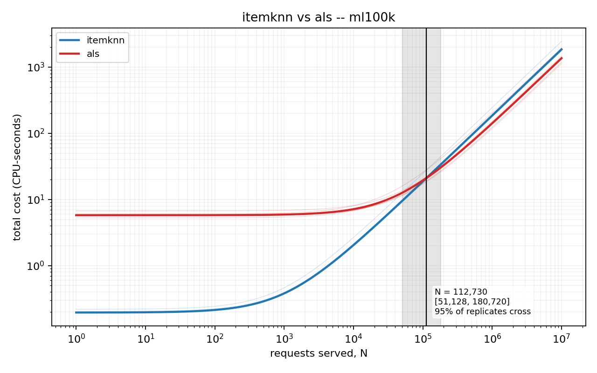
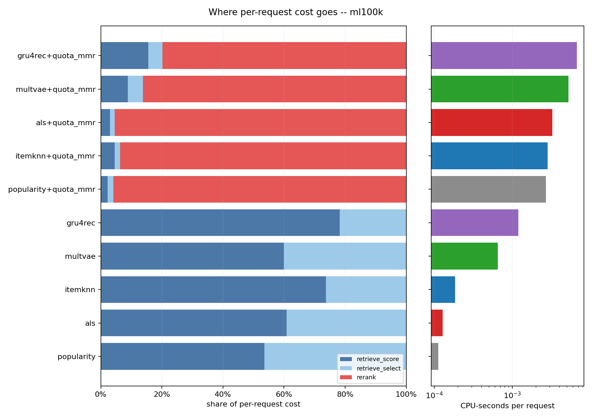
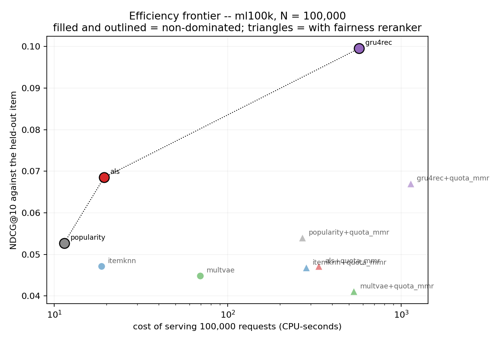
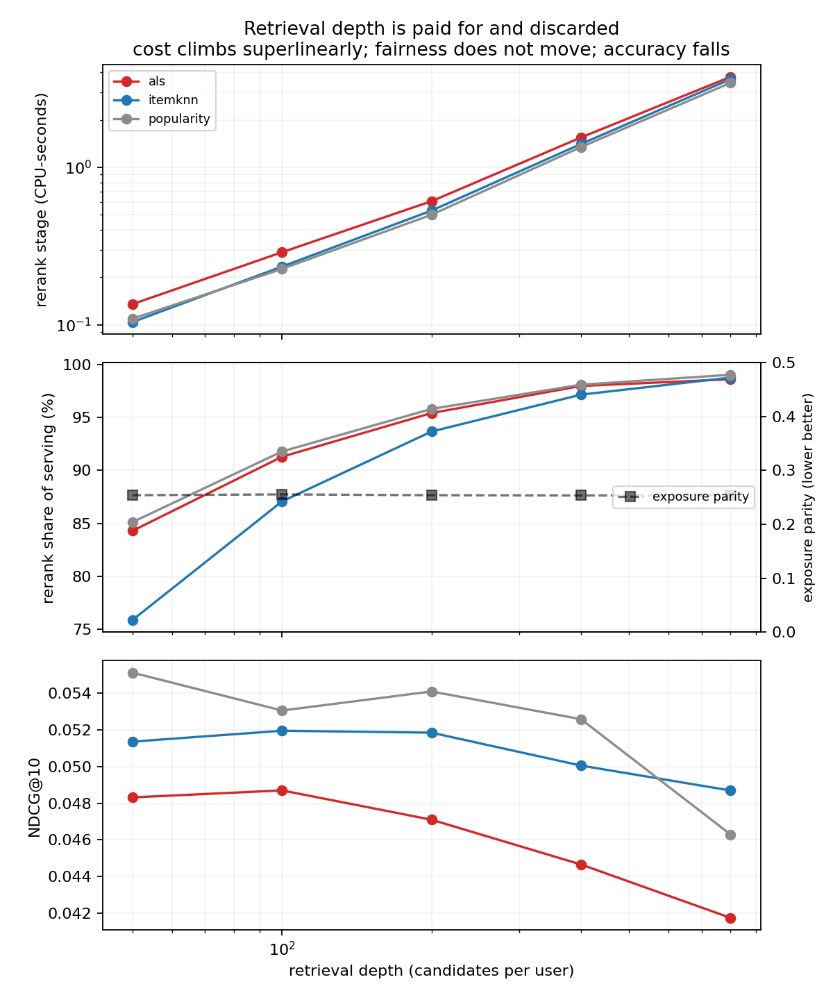

# The cost of a recommendation, by stage

**Status:** complete. The cross-catalogue sweep ran to completion on an idle machine —
170 runs, zero failures, every row passing the trust check — and §7 reports it. Figures
are in `results/main/figures/`, tables in `results/main/tables/`, and the raw per-stage
readings in `results/main/readings.csv`.

---

## Summary of findings

**Break-even exists and is measurable.** ItemKNN against ALS on MovieLens 100K crosses at
**N = 112,730 requests** (95 % CI 51,128 – 180,720). Below that the neighbourhood model is
the cheaper deployment; above it, the factor model. Only 13 of 45 configuration pairs
cross stably enough to report, and that denominator is part of the result: amortisation
often has no answer, because one family simply dominates. §7.1

**A fairness reranker costs 81–98 % of per-request serving cost**, multiplying serving
cost 5.3× to 43.8×. Adding exposure fairness to a popularity baseline multiplies its
serving cost 24-fold. No prior energy study appears to have costed this stage at all. §7.2

**When reranking for fairness, retrieve shallowly.** Going from 50 to 800 candidates costs
35× more (cost scales O(n^1.2–1.3)), yields *no* measurable fairness improvement — exposure
parity is flat at 0.254 across the whole range — and *loses* accuracy. §7.6

**MovieLens 100K is an outlier, and it is the catalogue everyone uses.** There, neither
ItemKNN nor ALS nor MultVAE is distinguishable from recommending the globally most popular
items; only GRU4Rec beats that baseline, for 2.7 million times popularity's training cost.
On the other four catalogues ItemKNN beats it clearly. A method validated only on ML-100K
can be reported as beating a baseline it does not beat. §7.5

**Retraining cadence is a larger lever than model choice.** Holding traffic fixed,
GRU4Rec's total cost moves **791×** between never retraining and retraining every 100
requests, with accuracy unchanged. §7.4

**The energy backend is blind on this hardware, and that is a reported result.** codecarbon
3.3.0 reports 0.0 % CPU utilisation under eight saturated cores, a hardcoded 10.000 W for
RAM, a 1.11× power swing from idle to saturation, and *less* total energy under full load
than at idle. A second test refuted this project's own hypothesis that the energy column
was merely a rescaled clock: it is worse than that. §5

---

## 1. The question

A deployer choosing a recommender model wants to know what it will cost to run. The
green-recommender literature answers a different question: it reports the energy of an
experimental *run*, which adds together

- a cost paid **once**, at deployment — training; and
- a cost paid on **every request** — retrieval, ranking, reranking.

Those are not the same kind of quantity and their sum is not interpretable. A model that
trains for an hour and then serves nearly free, and one that trains instantly and then
burns an hour answering queries, can report identical totals and imply opposite
decisions. The sum is dominated by whichever term the experimenter's setup happened to
emphasise: run the evaluation over 100 users and training dominates; run it over
10 million and serving does. Neither number is a property of the model.

Separating them gives

```
C(N) = C_once + N · C_per_request
```

Two families are then two lines, and lines with different slopes **cross**. The crossing
point — the request volume at which the cheaper choice changes — is the form a
deployment decision actually takes, and it is what this project reports.

## 2. What is not claimed

The obvious claim, "nobody has compared model families on energy", is false and this
project does not make it. Wegmeth, Beel and colleagues (ACM TORS 2025; code at
`ISG-Siegen/recsys-carbon-footprint`) measured 63 algorithms across 14 datasets with a
physical smart-plug meter, and separated fit / predict / evaluate. That work is more
comprehensive on the axis it covers than anything here.

Three things it does not do, which this project does:

1. **Amortisation.** Prior work reports energy per run. The break-even request volume
   does not appear.
2. **The reranker as a line item.** The stage decomposition stops at predict. Fairness
   rerankers are proposed steadily in the fairness-in-ranking literature and, as far as
   this search found, have never been costed.
3. **Validity of the measurement instrument** on hardware without power counters —
   which is most laptops, all of Windows, and every VM.

## 3. Setting: why a 15 W laptop is the right machine

Intel i5-8350U (4 cores / 8 threads, 15 W TDP), integrated graphics, 32 GB RAM,
Windows 10. No discrete GPU, no RAPL, no smart plug, no cloud budget.

This is a constraint, and it is also the regime the literature does not cover. Published
energy studies run on server or workstation hardware with instrumentation attached. A
small vendor deploying a recommender does not have that machine; they have this one.
Results measured here describe the hardware such a deployment actually runs on.

The measurement consequences are handled explicitly rather than absorbed: see §4.

## 4. Measurement method

### 4.1 The unit is CPU-seconds

Not kWh, and the reason is §5.

CPU-seconds are read from `time.process_time()`, which the kernel maintains and which
counts **every thread**. That matters more than it sounds: a BLAS matmul spread over four
cores registers four CPU-seconds per wall-second, and a torch training step likewise.
Wall-clock would report such a stage as four times cheaper than it is, which is exactly
backwards for an energy proxy. Measured here, GRU4Rec's training consumed 270.9
CPU-seconds against 69.8 seconds of wall-clock — a 3.9× parallelism that wall-clock
would have hidden entirely.

Joules are reported only through `Reading.joules(watts_per_cpu_second)`, which has **no
default argument**. A joule figure cannot appear anywhere in this project's output
without its conversion assumption visible beside it.

This does not weaken the break-even result. `C(N)` is linear, so a crossover computed in
CPU-seconds is the *same request count* as one computed in joules, provided the
conversion is a constant.

### 4.2 Stages

| stage | amortisation | contents |
|-------|--------------|----------|
| `train` | once | fitting the model |
| `rerank_setup` | once | item–item similarity the reranker requires |
| `retrieve_score` | per request | scoring the catalogue for a user |
| `retrieve_select` | per request | taking the top-n from those scores |
| `rerank` | per request | selecting k from the candidate set |

Retrieval is split into scoring and selection because selection turned out to be the
**majority** of retrieval cost — 99.9 % of it for popularity, ~50 % for ItemKNN. Reported
as one figure it would compress the families toward each other and attribute most of
their serving cost to code that is identical across all of them. Splitting it isolates
the part that is genuinely the family's own.

There is deliberately **no scoring stage**. Metric computation is O(k²) per user in pure
Python; inside a measured window it would be noise against a training run and the
majority of the reading against a cheap retrieval — error concentrated exactly where the
comparison between families is decided. `Stage` has no member for it, so no call site can
pass one.

### 4.3 The four traps

Each was found the hard way. They share a signature: **the run completes, the table looks
normal, and only the cost column is wrong.**

**The probe is not free.** `EmissionsTracker.start()` interrogates the hardware for
seconds. Timing from before it charged that constant to whatever followed; in the
companion project a baseline doing 0.008 s of real work read 5.4 s. The clock now starts
strictly after the probe and stops strictly before teardown.

**The clock is 15.625 ms, not 100 ns.** `time.get_clock_info("process_time")` advertises
100 ns resolution. The true quantum is the scheduler tick — five orders of magnitude
coarser. A 3 ms stage reads either `0.0` or `0.0156`, and two stages differing tenfold
can report the same number. `measure_repeated` repeats work until the window spans ~20
quanta, bounding quantisation error at ~5 %, and divides. Readings that could not be
grown are flagged `below_quantum` rather than reported as measurements. In practice this
means repeat counts from 1 to 2,434 across stages in a single run, all normalised to a
0.3125 s window.

**Battery changes everything except the results.** Unplugged, this machine drops from
~3.6 GHz to a pinned 1.297 GHz; every timing rises ~2.8× and every quality metric stays
byte-identical. Preflight refuses to start on battery. Because a cable can come out at
run seven of twenty, `ConditionsMonitor` also samples power source and CPU frequency
*during* a sweep and flags the whole run if either moves.

**Contention is charged to whoever is running.** Runs are strictly sequential, enforced
by an atomic lockfile. Before starting, machine load is sampled; above a threshold the
sweep aborts, and above a lower threshold every row is stamped `trustworthy=False` and
**the analysis refuses to read it**. This is not hypothetical — during this project's
development the machine was frequently occupied by the companion project's own
experiments, and the guard is what kept those hours from producing a plausible-looking
results table.

### 4.4 A leakage trap, found by running the sweep

The first attempt at the full sweep failed on its second cell, and the cause was not a
cost bug.

Seen items are excluded from recommendation by scoring them `-inf`. Retrieval then asks
for the top *n* candidates. On a small catalogue those two facts collide: `gift_cards`
has 147 items, retrieval depth was set to 200, and a user with twelve interactions has
only 135 candidates that mean anything. The remaining slots were filled with `-inf`
entries — which are, precisely, that user's own history.

Downstream, normalising the candidate scores computed `-inf − -inf = NaN`, so the
reranker received a relevance vector of NaNs, ranked on them, and could place an
already-seen item into the final list. Every metric would still have been computed, and
nothing in the output would have looked wrong.

The fix caps retrieval depth at `n_items − (busiest served user's history)`, records both
the requested and the actual depth on every row — a reranker's cost scales with its
problem size, so a run that quietly retrieved 135 instead of 200 is not comparable to one
that got 200 — and makes the normalisation *raise* on non-finite input rather than
propagate NaN, as an assertion that the cap holds rather than a patch over its absence.

Worth stating plainly because it is the project's own thesis turned on itself: the bug
was found by running the experiment, not by reading the code, and it belongs to the same
family as everything in §4.3 — a defect that changes the results and leaves the output
looking entirely normal.

### 4.5 Uncertainty on the break-even

A crossover is a ratio of two differences:

```
N = (C_once,B − C_once,A) / (C_per_request,A − C_per_request,B)
```

so it amplifies the noise in both. Repeated measurements of *identical* work on this
machine differ by tens of percent — popularity's training stage needed 1,774 repeats in
one run and 2,434 in the next to fill the same window. When two families' per-request
costs are within that spread, the denominator can approach zero and the crossover can
move by orders of magnitude or cease to exist.

Every configuration is therefore measured with repeats, and the crossover is reported as
a **percentile bootstrap interval** over them, resampling each family's `(once,
per_request)` pairs jointly — jointly because a moment of background load inflates both,
and resampling them independently would manufacture combinations never observed and
report an interval narrower than the truth.

Replicates in which the lines do not cross are **counted, not discarded**. Their share is
reported, and a crossover found in only a minority of replicates is a null result, not a
wide interval. This is not a theoretical safeguard: on cost figures of the size measured
in this project's early synthetic runs, only **7 %** of replicates crossed, and among
those the interval spanned 1,303 to 710,392 requests. A single-observation estimate had
reported `N = 13,736`. That number was false precision, and the earlier draft of this
project stated it.

## 5. Result: the energy backend is blind here

**This is a measured result, not a caveat.**

`codecarbon` on hardware without RAPL estimates CPU power from rated TDP and a
utilisation sample. If that estimate does not track utilisation, reported energy
degenerates to `kWh ≈ constant × seconds`, and every "energy" conclusion drawn from it is
a wall-clock conclusion in different units.

Tested directly with a graded load — 0, 1, 2, 4 and 8 busy **processes** (processes, not
threads: the GIL would let a thread-based load saturate one core while the rest idled,
handing the backend an easier test than it needs to pass).

Measured on **codecarbon 3.3.0**, five conditions of 20 seconds each, on an idle machine:

Reproduced verbatim from `results/validity/graded_load.csv`:

| busy workers | reported CPU power | reported utilisation | reported RAM power | total energy |
|--------------|--------------------|----------------------|--------------------|--------------|
| 0 | 1.500 W | 0.0 % | 10.000 W | 7.371e-05 kWh |
| 1 | 1.501 W | 0.0 % | 10.000 W | 6.601e-05 kWh |
| 2 | 1.503 W | 0.0 % | 10.000 W | 6.620e-05 kWh |
| 4 | 1.521 W | 0.0 % | 10.000 W | 6.715e-05 kWh |
| 8 | 1.660 W | 0.0 % | 10.000 W | 7.329e-05 kWh |

Four things, none of which is a matter of precision:

1. **Utilisation reads exactly 0.0 % at every level**, including eight saturated cores.
2. **CPU power moves 1.11×** across the full span from idle to saturation, against a true
   dynamic range of roughly 10× for a 15 W part.
3. **RAM power is exactly 10.000 W at every level** — a hardcoded constant, and it
   dominates the total. A channel that is bit-for-bit identical from idle to full
   saturation is not a noisy measurement of the load; it is not a measurement of the
   load, and it needs no threshold to interpret.
4. **The fully loaded run reports less total energy than the idle one** (7.329e-05
   against 7.371e-05 kWh), despite running 1.3 seconds longer.

An earlier draft of this section recorded that 3.3.0 had partly fixed the utilisation
probe, having seen it report 16.7 % once. That observation was taken while another
process was occupying the machine, so what it measured was the *other* process. On an
idle machine the probe reads zero at every load, exactly as the 2.x observation did. The
correction is noted rather than quietly removed, because it is the same error this
project is about — a plausible number, produced under conditions that were not checked.

### 5.1 The second test refuted the hypothesis, and the answer is worse

The graded load asks whether the backend can see a *known* load. A second test asks a
weaker and more directly relevant question: on the actual workloads this study measures,
does the energy column say anything the clock does not?

The stated hypothesis (§4.1, and `analysis/validity.py`) was that reported energy would
degenerate to `kWh ≈ constant × seconds` — that it would be a rescaled clock, giving an
R² near 1.0 against elapsed time. That is a specific, falsifiable prediction and it is
**wrong**.

Regressed over 144 readings from a meter-enabled sweep spanning four orders of magnitude
of workload cost:

| reference | R² | Spearman | spread of the conversion ratio |
|-----------|-----|----------|-------------------------------|
| CPU-seconds | 0.551 | 0.610 | **13.7×** |
| wall-clock | 0.555 | 0.709 | 13.1× |

The energy column is not a rescaled clock. It is worse: it does not track time reliably
either. Barely half the variance is explained by a straight line, and the implied
kWh-per-CPU-second conversion varies by a factor of **13.7** across runs — so it is not a
constant misestimate that could be calibrated away, which a rescaled clock would at least
have been.

Reported as a refuted prediction rather than folded into the narrative, because the
project's own machinery classified it as "carries some information beyond the reference"
and that phrasing is too generous. The information it carries is not information about
energy; a column whose conversion factor moves by 13.7× while measuring the same machine
is measuring its own sampling cadence.

### 5.2 Why no other route was available

The machine exposes no RAPL. WSL2 does not help — verified rather than assumed:
`/sys/class/powercap` exists but is empty and `/dev/cpu/0/msr` is absent, because the
hypervisor does not pass the counters through. Colab is not a substitute either, since a
shared CPU reintroduces contention.

**Consequence.** CPU-seconds is the reported unit. The `codecarbon` failure is folded in
as a result of the project rather than worked around silently, and
`experiments/validity.py` reproduces it on any machine in about two minutes.

## 6. Datasets

Six registered catalogues, spanning roughly two orders of magnitude in size, because the
break-even claim is a statement about how serving cost scales with catalogue size and
cannot be demonstrated on one.

| catalogue | users | items | interactions | groups |
|-----------|-------|-------|--------------|--------|
| `gift_cards` | 456 | 147 | 2,498 | popularity tiers |
| `software` | 1,779 | 727 | 10,073 | popularity tiers |
| `ml100k` | 943 | 1,349 | 98,344 | curator genres |
| `luxury_beauty` | 3,589 | 1,365 | 23,860 | popularity tiers |
| `digital_music` | 16,252 | 11,268 | 127,939 | popularity tiers |
| `appliances` | 13 | 4 | 23 | **excluded** |

All after 5-core filtering and a leave-one-out split, using the companion project's
preprocessing so that the two projects agree exactly on which interactions survive.

`appliances` is excluded and the exclusion is stated rather than left as a gap: the
ratings-only export is so long-tailed that 5-core filtering reduces it to 13 users and 4
items. That is a property of the export, not a loading bug, and a full row of metrics
computed over four items would be a number rather than a measurement. The driver refuses
it by a viability check on every catalogue.

MovieLens uses **curator genres** for fairness groups rather than popularity tiers. A
popularity partition is derived from the same interaction counts being evaluated, so any
fairness result on it can be argued to be structural; genres are assigned independently
of the data.

## 7. Results

**Provenance.** 170 runs — 5 catalogues × up to 5 families × {no reranker, `quota_mmr`}
× 5 repeats — serving 200 users each at retrieval depth 200 and k = 10. Zero failures.
All 170 rows passed the trust check (machine 13.3 % busy at start, below the 15 %
threshold), the conditions monitor recorded mains power throughout with no frequency
change across 1,981 samples, and **no stage fell below the clock quantum** — every
reading was grown above the scheduler tick rather than reported as one.

Run-to-run spread on identical work ranged from 12 % to 90 % of the median, with a
median of 25 %. That is the noise floor every difference below has to clear, and it is
why the break-even is reported as an interval rather than a point.

### 7.1 Break-even between families

**MovieLens 100K, ItemKNN against ALS: N = 112,730 requests, 95 % CI [51,128 – 180,720],
95 % of bootstrap replicates crossing.**

Below roughly 110,000 requests the neighbourhood model is the cheaper deployment; above
it, the factor model. ItemKNN trains in 0.195 CPU-seconds and serves at 1.86e-4 per
request; ALS trains in 5.78 and serves at 1.36e-4. Neither figure alone answers "which
should I deploy" — their crossing point does, and it is the kind of number no per-run
energy table can produce.

A second stable crossing on the same catalogue: ALS against MultVAE at N = 2,639
[361 – 5,248], all replicates crossing.



The shaded band is the bootstrap interval and the faint lines are the individual
repeats, so the width the band claims is visibly earned rather than asserted.

**The more important result is how few pairs cross at all.** Of 45 configuration pairs on
MovieLens 100K, only 13 produce a crossover this analysis is willing to report. The rest
are either outright domination — one family cheaper at every volume, which is a finding,
not a missing number — or crossings too unstable under resampling to state. Reporting
only the 13 and omitting that denominator would misrepresent how often the amortisation
question even has an answer.

### 7.2 The cost of fairness reranking

**The reranker accounts for 81 – 98 % of per-request cost, multiplying serving cost by
5.3× to 43.8×.** Measured across all five catalogues and every family, 17 configurations
in total.

All seventeen configurations, highest share first. The share is computed per run and
then taken as a median, not as a ratio of two medians -- the two disagree by 2.7
percentage points at the low end, which is the endpoint this study quotes.

| catalogue | family | rerank share | serving multiplier |
|-----------|--------|--------------|--------------------|
| `luxury_beauty` | `popularity` | 97.7 % | 43.8× |
| `software` | `itemknn` | 97.1 % | 35.0× |
| `software` | `als` | 97.1 % | 34.2× |
| `gift_cards` | `als` | 96.8 % | 31.2× |
| `gift_cards` | `itemknn` | 96.6 % | 29.8× |
| `software` | `popularity` | 96.5 % | 28.8× |
| `luxury_beauty` | `itemknn` | 96.3 % | 27.0× |
| `gift_cards` | `popularity` | 96.1 % | 25.8× |
| `ml100k` | `popularity` | 95.9 % | 24.3× |
| `ml100k` | `als` | 95.6 % | 22.6× |
| `luxury_beauty` | `als` | 95.6 % | 22.5× |
| `digital_music` | `popularity` | 94.3 % | 17.4× |
| `ml100k` | `itemknn` | 93.7 % | 15.8× |
| `digital_music` | `itemknn` | 88.5 % | 8.7× |
| `ml100k` | `multvae` | 85.9 % | 7.1× |
| `ml100k` | `gru4rec` | 82.5 % | 5.7× |
| `digital_music` | `als` | 81.3 % | 5.3× |

One caveat the row-level records make visible. `gift_cards` has 147 items, so the cap of
§4.4 bound there and its runs used a retrieval depth of 117–126 rather than the nominal
200. Since §7.6 shows the share depends on depth, those rows are not at the same problem
size as the rest and are not strictly comparable to them. They are kept because the
qualitative claim is unaffected and the difference is recorded on every affected row
rather than being absorbed into an average.



The left panel is share on a linear axis and the right is absolute cost on a log one,
because a stacked bar on a log axis has segment widths that mean nothing -- and share is
exactly what this claim is about.

The share has structure rather than being a constant: it falls as retrieval itself gets
more expensive. The reranker's cost is set by its problem size — 200 candidates, k = 10 —
not by the model beneath it, so it dominates a cheap popularity lookup almost entirely
and merely doubles-and-a-bit the cost of serving a GRU4Rec.

This is, as far as the literature search found, the first published figure for what a
fairness reranker costs as a share of a recommender pipeline. It is also the project's
most directly actionable number: a deployer adding exposure fairness to a popularity
baseline is not paying a margin, they are paying **24 times** their serving cost.

What that buys is large and unambiguous. On MovieLens 100K exposure parity improves from
1.186 to 0.257 (lower is better) — and on `software` the paired test finds it better on
**200 of 200 users**, p < 0.0001.

### 7.3 Efficiency frontier

Non-dominated configurations at N = 100,000 requests:

| catalogue | frontier |
|-----------|----------|
| `ml100k` | `popularity`, `als`, `gru4rec` |
| `software` | `popularity`, `itemknn`, `als` |
| `digital_music` | `popularity`, `itemknn`, `itemknn+quota_mmr` |
| `luxury_beauty` | `popularity`, `itemknn` |
| `gift_cards` | `itemknn` |

**ItemKNN and MultVAE are dominated on MovieLens 100K.** At 100,000 requests ItemKNN
costs 18.75 CPU-seconds against popularity's 11.40 (1.65×) for a median NDCG of 0.0471
against 0.0527; MultVAE costs 69.48 (6.10×) for 0.0448. On that catalogue neither should
be deployed at any traffic level.

The frontier is computed on *median* accuracy, and §7.5 finds that neither family's
accuracy difference from popularity is statistically detectable per user. That does not
weaken the conclusion — it strengthens it. Domination normally rests on being worse on
one axis and no better on the other, which invites the objection that the accuracy gap is
noise. Here the accuracy gap being indistinguishable is the point: at **no detectable
difference in accuracy**, ItemKNN costs 1.65× more and MultVAE 6.10× more. The
recommendation follows from the cost axis alone, where the measurement is solid.

`popularity` appears on four of five frontiers, always as the cheap endpoint.



The frontier's axes are accuracy and cost only, so every reranked configuration except
one falls behind it — reranking buys exposure parity, which is not an axis here. The
`digital_music` row is the exception worth noting: there `itemknn+quota_mmr` is
non-dominated on accuracy and cost alone, meaning reranking *improved* NDCG on that
catalogue rather than trading it away.

### 7.4 Retraining cadence

Holding traffic fixed at 100,000 requests on MovieLens 100K and varying only how often
the model is retrained:

| retrain every | `popularity` | `itemknn` | `als` | `multvae` | `gru4rec` |
|---------------|--------------|-----------|-------|-----------|-----------|
| never | 11.4 | 18.8 | 19.4 | 69.5 | 571 |
| 100,000 | 11.4 | 18.9 | 25.2 | 73.9 | 1,023 |
| 10,000 | 11.4 | 20.7 | 77.2 | 113 | 5,086 |
| 1,000 | 11.4 | 38.3 | 598 | 507 | 45,720 |
| 100 | 11.6 | 214 | 5,801 | 4,444 | 452,056 |

All figures CPU-seconds.

**Cadence moves total cost by 791× for the neural family while changing its accuracy not
at all.** That is a far larger lever than the choice of model, and it is absent from every
energy figure that reports a single run.

The ordering also reverses: **ALS and MultVAE swap** below a 1,000-request cadence. ALS
serves nearly five times cheaper (1.36e-4 against 6.51e-4) but trains a third dearer, so
which is preferable depends entirely on how fast the catalogue goes stale — a question
the model comparison itself cannot answer.

`popularity` is cheapest at every cadence here, which is a degenerate but honest outcome:
its training is effectively free, so retraining costs it nothing. The cadence axis only
discriminates between models that actually train.

### 7.5 Accuracy, tested rather than averaged

87 paired comparisons against a popularity baseline, one Holm correction across the whole
family; 51 reach significance. Restricting to NDCG and to families without a reranker:

| catalogue | beats `popularity` on NDCG | does not |
|-----------|----------------------------|----------|
| `luxury_beauty` | `itemknn` (49/0), `als` (42/1) | — |
| `software` | `itemknn` (28/1), `als` (27/2) | — |
| `gift_cards` | `itemknn` (54/8) | `als` |
| `digital_music` | `itemknn` (13/2) | `als` |
| `ml100k` | `gru4rec` (42/16) | `itemknn`, `als`, `multvae` |

Win/loss counts in parentheses; all listed rows are significant after correction.

**ItemKNN beats the popularity baseline on four of five catalogues.** So the strong
version of the Green RecSys concern — that expensive models routinely buy nothing — is
*not* what this study found, and an earlier draft of this section said it did, on the
strength of MovieLens 100K alone. That draft would have been a confident generalisation
from the one catalogue that happens not to support it.

What the data does support is narrower and still worth saying:

- **MovieLens 100K is the exception, and it is the catalogue everyone uses.** There,
  neither ItemKNN nor ALS nor MultVAE is distinguishable from recommending the globally
  most popular items. Only GRU4Rec beats the baseline (NDCG 42/16, p = 0.043; recall
  37/11, p = 0.0073) — for 451 CPU-seconds of training against popularity's 0.000167, a
  factor of 2.7 million. A method validated only on ML-100K can therefore be reported as
  beating a baseline it does not beat.
- **The winner is catalogue-dependent.** ALS beats popularity on two catalogues and not
  on three. ItemKNN, which is *dominated* on ML-100K, is the most reliable performer
  across the rest.
- **Means would have hidden both.** On ML-100K the raw figures (`als` 0.0685 against
  `popularity` 0.0527) read as a 30 % improvement, and it does not survive a paired test.

Reranking's effect on accuracy also runs both ways, which is worth stating because it is
usually assumed to be a cost. On `digital_music` and `luxury_beauty` the reranked variants
are among the *significant winners* on NDCG; on `ml100k` reranking lowers it. Exposure
parity, meanwhile, improves on 200 of 200 users everywhere it is applied.

### 7.6 How much of §7.2 is an artefact of retrieval depth?

The reranking-cost claim is measured at one retrieval depth, and the reranker's cost
scales with its problem size — so as stated it is a claim about 200 candidates. A reader
is entitled to ask whether the headline share is a consequence of that choice. Testing it
was a matter of varying depth over a 16× range with everything else fixed: 90 runs on
MovieLens 100K, three families, three repeats.

**Reranker share of per-request cost:**

| depth | `popularity` | `itemknn` | `als` |
|-------|--------------|-----------|-------|
| 50 | 85.1 % | 75.9 % | 84.3 % |
| 100 | 91.8 % | 87.1 % | 91.3 % |
| 200 | 95.8 % | 93.7 % | 95.4 % |
| 400 | 98.1 % | 97.2 % | 98.0 % |
| 800 | 99.1 % | 98.8 % | 98.6 % |

**The share is depth-dependent, so §7.2's range is narrower than it first appears.** The
honest statement is: at the depth this study used, reranking is 80–98 % of serving cost;
across a 16× range of depth it is 76–99 %. The qualitative claim — that the reranker
dominates per-request cost — survives everywhere tested, but the specific percentage
should always be quoted with its depth.

What makes the sensitivity worth its own section is the rest of the table. Fitting cost
against depth on log axes gives **O(n^1.20) to O(n^1.28)** — superlinear, as expected from
extracting an n × n similarity block per user. Over the range tested, cost rises 35×.

And it buys nothing:

| depth | exposure parity (lower better) | NDCG@10 (`popularity`) |
|-------|-------------------------------|------------------------|
| 50 | 0.2540 | 0.0551 |
| 100 | 0.2555 | 0.0531 |
| 200 | 0.2540 | 0.0541 |
| 400 | 0.2535 | 0.0526 |
| 800 | 0.2540 | 0.0463 |

Exposure parity is **flat** — 0.2535 to 0.2555 across the whole range, well inside
run-to-run noise. Accuracy *falls*. So retrieving 800 candidates instead of 50 costs 35×
more in the reranking stage, delivers no measurable fairness improvement, and loses
NDCG.



That is the most directly actionable recommendation in this report: **when reranking for
exposure fairness, retrieve shallowly.** The fairness objective is satisfied by the head
of the candidate list, and everything below it is paid for and discarded.

## 8. Threats to validity

**One machine.** Every figure is from a single laptop. The break-even *request counts*
should transfer better than the absolute costs, since both sides scale together, but this
is an argument rather than a measurement.

**Python implementations.** ItemKNN and ALS are written against numpy rather than taken
from a compiled library. This keeps the training cost measurable rather than a black box,
and both are dense linear algebra where numpy dispatches to BLAS — but a compiled
implementation would shift the absolute numbers.

**Leave-one-out with a single held-out item** makes NDCG@10 small in absolute terms and
noisy per user. It is the companion project's protocol, kept deliberately so the two are
comparable.

**The reranker's problem size** was fixed at 200 candidates for the main sweep. §7.6
measures the sensitivity directly rather than leaving it as a caveat: the share moves
from 76 % to 99 % across a 16× range of depth, so the qualitative claim holds throughout
but any specific percentage must be quoted with its depth.

**No LLM family.** Deliberately omitted with the slot documented: its energy burns in a
datacentre that cannot be instrumented from here, and an API-derived estimate placed
beside directly measured CPU-seconds would put two incomparable quantities in one column.

## 9. Reproducing

```bash
# §5 -- the energy-axis check. Two minutes, no dataset needed.
python -m experiments.validity --readings results/energy/readings.csv

# §7.1-7.5 -- the main sweep. ~75 minutes on the development machine.
python -m experiments.sweep    --config experiments/configs/main.yaml
python -m experiments.analyse  --results results/main
python -m experiments.compare  --results results/main --reference popularity
python -m experiments.figures  --results results/main

# §7.6 -- retrieval-depth sensitivity. ~25 minutes.
python -m experiments.sweep    --config experiments/configs/depth.yaml
python -m experiments.analyse  --results results/depth

# §5.1 -- the agreement test needs a meter-enabled sweep. ~10 minutes.
python -m experiments.sweep    --config experiments/configs/energy.yaml

# Every number quoted in this report, regenerated from the results.
python -m experiments.headline --results results/main
```

That last command exists because this report drifted from its own data once: §5's table
was transcribed from a validity run that a later run superseded, and both sets of numbers
were plausible enough that nothing caught it. Prose is written by hand and nothing checks
it, so the numbers are now regenerated rather than remembered.

The sweep resumes by default, so an interrupted run continues where it stopped. Repeat is
the outermost loop, so a partial sweep still holds one complete observation of every cell
rather than five of the first family and none of the rest.

Each results directory carries a `manifest.json` recording the revision of **both**
repositories — every accuracy metric here is computed by companion code, so a provenance
record naming only this one would be half a record. A dirty working tree is recorded as
`abc1234-dirty`, because that is not a version anyone can return to.
